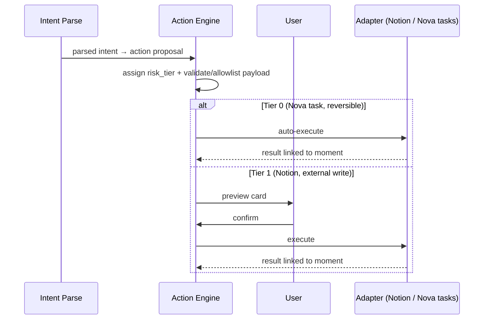

# Build Plan

**Why this document exists.** This is the plan to start writing code today. It turns the scope in [MVP_SCOPE.md](./MVP_SCOPE.md) into milestones, a fixed tech stack, a concrete schema, real API endpoints, and named first modules — with the tradeoffs stated, not hidden. A new engineer should be able to read this and open a terminal. It aligns with the risk mitigations in [RISKS_AND_RED_TEAM.md](./RISKS_AND_RED_TEAM.md) and the architecture in [SYSTEM_ARCHITECTURE.md](./SYSTEM_ARCHITECTURE.md).

The MVP, restated: **Chromium MV3 extension + Fastify/Postgres+pgvector/Redis backend + Next.js web app + Notion integration + Nova's own task list.** Single user, English-first.

---

## 1. Milestones

Twelve weeks to a private alpha. Each milestone has deliverables, a literal demo script, and acceptance criteria. If we slip, we cut per the [MVP_SCOPE cut lines](./MVP_SCOPE.md#6-cut-lines-ordered-if-behind-schedule) before we slip the date.

### M0 — Walking skeleton (weeks 1–2)

The entire loop, end-to-end, trivially. No intelligence yet — just proof the pipes connect.

**Deliverables:**
- Monorepo scaffold (pnpm + Turborepo): `packages/schema`, `services/api`, `apps/extension`, `apps/web`, plus `docker-compose.yml` for Postgres + Redis.
- Extension (WXT + React MV3): side panel with an "idle" state, a capture button that calls `chrome.tabs.captureVisibleTab` + a content-script DOM extract, and a text box for a typed instruction.
- `POST /v1/context/moments` on the Fastify API storing a Context Moment (frame ref + extracted text + metadata + intent) in Postgres.
- Web app: a timeline page listing stored moments.

**Demo script:** *"On any web page, I open Nova's side panel, click Capture, type 'remember this for the pricing project', and hit submit. I switch to the Nova web app, refresh the timeline, and my captured page — screenshot thumbnail, page title, my note — is there."*

**Acceptance criteria:**
- Capture → stored → visible in web list works on 5 diverse real pages.
- No frontier-model calls yet; DOM text is stored verbatim.
- Extension permission set is already minimal (`activeTab`, `scripting`, `storage`, `sidePanel`) — no `<all_urls>`.

### M1 — Voice, intent, projects, tasks (weeks 3–4)

**Deliverables:**
- Push-to-talk voice in the side panel: `MediaRecorder` → chunked upload → Whisper API → transcript shown, editable before submit. Typed input remains.
- `packages/model-router` v0: one primary model + one fallback, with a fallback-on-error path.
- Intent parsing: transcript → structured intent (project hint, action type, action content).
- Project auto-suggest (embedding similarity + recency) → confirm/override; overrides logged.
- Tier-0 action: create a task in Nova's own task list, linked to the moment.

**Demo script:** *"I capture a page, press and hold to talk — 'draft a task to follow up with Acme about their API limits, this is for the Acme project.' The transcript appears, I tweak a word, submit. Nova suggests the Acme project (87%), I confirm, and a Nova task appears linked to the moment."*

**Acceptance criteria:**
- ASR round-trip < 3s for a 10s clip; transcript editable.
- Project suggestion top-3 includes the correct project ≥70% of the time on seeded data.
- Model-router falls back to secondary on a forced primary failure, logged in the audit trail.

### M2 — Notion + memory search (weeks 5–6)

**Deliverables:**
- Notion adapter: OAuth connect in settings; Tier-1 action = preview-then-confirm card → on confirm, create a Notion page; result linked to the moment.
- Enrichment worker (BullMQ): summary, entity extraction, embedding write to pgvector.
- Memory timeline with **hybrid search** (Postgres full-text + pgvector cosine), project detail page, action-approvals queue.

**Demo script:** *"I capture a spec page and say 'create a Notion doc summarizing this for the roadmap.' A preview card shows the proposed Notion page title + body. I click Confirm; the page is created in my Notion, and the link shows on the moment. Then I search 'API limits' in the timeline and both the Acme task moment and this one come back, ranked."*

**Acceptance criteria:**
- Tier-1 action never writes to Notion without an explicit confirm.
- Hybrid search returns relevant moments; vector recall verified against a golden query set.
- Enrichment completes async without blocking capture response (<300ms API response; enrichment eventually-consistent).

### M3 — Live Context Mode v0 (weeks 7–9)

**Deliverables:**
- `chrome.tabCapture` live session with visible indicator + 30-min hard cap.
- Offscreen document hosting a ring buffer: 1 fps frames + tab-audio transcript, RAM/temp only, auto-purged on end.
- Live Q&A over the buffer via push-to-talk; grounded answers with on-screen citations; "save this" → Context Moment.

**Demo script:** *"I'm watching a conference talk in a tab. I start a Nova live session — a red indicator shows it's active. Mid-talk I ask 'what did they say the three scaling bottlenecks were?' Nova answers from the last 60 seconds and cites the slide. I hit 'save this' and it becomes a moment on my Research project. I end the session; the buffer is gone."*

**Acceptance criteria:**
- Buffer never exceeds 60s of frames + transcript in memory; verified purged on end.
- Live-answer latency < 4s median; groundedness ≥ target on a scripted test set.
- Session cannot exceed 30 min; indicator present whenever capture is active.

### M4 — Hardening + alpha deploy (weeks 10–12)

**Deliverables:**
- Capture-time **redaction pass** (password fields, financial-identifier patterns, best-effort faces) before storage.
- Onboarding flow, data export (open format), one-click deletion, audit-log view.
- Encryption checks (client-side media encryption, KMS token encryption), structured logging with payload/secret stripping.
- Deploy to Fly.io/Railway; instrumentation for the alpha funnel ([MVP_SCOPE §9](./MVP_SCOPE.md#9-alpha-plan)).

**Demo script:** *"A new alpha user installs the extension, connects Notion in a 60-second onboarding, captures with redaction masking a visible password field, and can export or delete all their data from settings. Every action they took is in the audit log."*

**Acceptance criteria:**
- Redaction masks seeded secrets in ≥90% of test captures.
- Full export and full deletion both verified end-to-end.
- Funnel instrumentation emits invoke/capture/link/action/return events; dashboard live.
- External-write actions all gated (Tier-1/2); prompt-injection test suite (§14) passes.

---

## 2. Recommended tech stack

Exact choices, one-line justification each, and the rejected alternative with the reason. TypeScript monorepo, pnpm + Turborepo.

| Layer | Choice | Justification | Rejected alternative |
|-------|--------|---------------|----------------------|
| Extension framework | **WXT** | MV3-native, HMR, handles manifest/build boilerplate; ships React. | Plain MV3 + webpack — more boilerplate, slower iteration. |
| Web app | **Next.js** | Mature React SSR, fast to build the timeline/approvals UI, easy deploy. | Remix/SPA — no compelling advantage for our surface. |
| API | **Fastify (Node 22)** | Fast, schema-first, lightweight; Zod plugin integrates our shared schemas. | **NestJS** — heavier DI/decorator framework we don't need at monolith scale; more ceremony than value. |
| ORM | **Drizzle** | SQL-first, typed, thin; migrations are readable SQL; no hidden query magic. | **Prisma** — heavier runtime, its own migration engine, less transparent SQL, awkward with pgvector. |
| Vectors | **pgvector** (in Postgres 16) | One datastore, transactional with the system of record, good enough to 100k+ users. | **Pinecone** — external service, extra cost/ops, needless until scale demands it. |
| Queue | **BullMQ + Redis** | Simple, reliable job queue for enrichment workers; we already run Redis. | **Kafka** — operational monster for our volume; event-log semantics we don't need yet. |
| ASR | **OpenAI Whisper API** (MVP) | Cloud, accurate, fast to integrate; disclosed to user. | whisper.cpp local — deferred to desktop companion; not needed for browser MVP. |
| LLM | **`packages/model-router`**, primary **Claude** (vision+reasoning), fallback GPT | Provider-agnostic; primary chosen for vision+reasoning quality; swappable. | Hard-coding one vendor — kills the neutral-layer thesis ([RISKS §3, §4](./RISKS_AND_RED_TEAM.md)). |
| Embeddings | **text-embedding-3-small** (swappable to voyage) | Cheap, 1536-dim, good recall; small enough for margin ([RISKS §8](./RISKS_AND_RED_TEAM.md)). | Large embedding models — cost with no MVP payoff. |
| Desktop (later) | **Tauri v2** | Smaller footprint, Rust core, better perf/security than Electron. | **Electron** — heavier, larger attack surface; deferred *and* rejected as the default. |
| Infra | **Docker Compose** (dev), **Fly.io/Railway** (MVP) | Trivial local stack; fast managed deploy without a platform team. | Kubernetes/Terraform — premature ops burden at alpha stage. |

Rejected patterns, explicitly: **Tauri later, not Electron. Fastify, not Nest. Drizzle, not Prisma. pgvector, not Pinecone. BullMQ, not Kafka. WXT for the extension.**

---

## 3. First modules — build order and why

```
packages/schema        → shared Zod schemas + inferred TS types + Drizzle table defs.
                         Build FIRST: everything imports it; it is the contract.
packages/model-router  → provider-agnostic LLM/ASR/embedding calls with fallback.
                         Build SECOND: API and workers both depend on it; isolate vendor churn.
services/api           → Fastify app: ingestion + query endpoints + BullMQ producers.
                         Build THIRD: needs schema + router; is the spine.
apps/extension         → WXT MV3 client: capture, side panel, voice, live buffer.
                         Build FOURTH: the primary user surface; talks to services/api.
apps/web               → Next.js: timeline, project, approvals, settings.
                         Build FIFTH: consumes the same API; reviewer/management surface.
services/worker        → BullMQ enrichment consumers (summary/entities/embedding/linking).
                         Grows alongside services/api from M2; shares schema + router.
```

The ordering is dependency-driven: the contract (`schema`) and the vendor isolation (`model-router`) come before anything that uses them, so we never rewrite call sites when a provider or a field changes.

---

## 4. First database schema

Complete DDL for the MVP. Postgres 16 + pgvector. Comments explain intent; key indexes included. This is the real starting schema, not a sketch.

```sql
-- Enable extensions
CREATE EXTENSION IF NOT EXISTS "pgcrypto";   -- gen_random_uuid()
CREATE EXTENSION IF NOT EXISTS "vector";     -- pgvector

-- Users --------------------------------------------------------------------
CREATE TABLE users (
  id            uuid PRIMARY KEY DEFAULT gen_random_uuid(),
  email         text NOT NULL UNIQUE,               -- login identity
  display_name  text,
  created_at    timestamptz NOT NULL DEFAULT now(),
  deleted_at    timestamptz                          -- soft delete; hard-purge job removes rows + media
);

-- Projects: the organizing unit context moments link to ----------------------
CREATE TABLE projects (
  id            uuid PRIMARY KEY DEFAULT gen_random_uuid(),
  user_id       uuid NOT NULL REFERENCES users(id) ON DELETE CASCADE,
  name          text NOT NULL,
  description   text,
  local_only    boolean NOT NULL DEFAULT false,      -- pinned local-only; excluded from cloud sync
  archived      boolean NOT NULL DEFAULT false,
  created_at    timestamptz NOT NULL DEFAULT now(),
  updated_at    timestamptz NOT NULL DEFAULT now()
);
CREATE INDEX idx_projects_user ON projects(user_id) WHERE archived = false;

-- Context Moments: the atomic captured unit --------------------------------
CREATE TABLE context_moments (
  id             uuid PRIMARY KEY DEFAULT gen_random_uuid(),
  user_id        uuid NOT NULL REFERENCES users(id) ON DELETE CASCADE,
  project_id     uuid REFERENCES projects(id) ON DELETE SET NULL,  -- null until linked
  source_mode    text NOT NULL,                       -- 'instant_capture' | 'live_context'
  source_meta    jsonb NOT NULL DEFAULT '{}',         -- {url, title, app, tab_id, favicon, viewport}
  payload        jsonb NOT NULL DEFAULT '{}',         -- raw normalized capture draft (DOM extract, UI semantics)
  extracted_text text,                                -- flattened searchable text (DOM + OCR + transcript)
  intent_text    text,                                -- user's spoken/typed instruction utterance
  summary        text,                                -- enrichment output; null until worker runs
  captured_at    timestamptz NOT NULL DEFAULT now(),
  enriched_at    timestamptz,                         -- set when enrichment completes
  redaction_state text NOT NULL DEFAULT 'pending',    -- 'pending' | 'applied' | 'skipped'
  tsv            tsvector,                            -- full-text index vector (maintained by trigger)
  created_at     timestamptz NOT NULL DEFAULT now()
);
CREATE INDEX idx_moments_user_time ON context_moments(user_id, captured_at DESC);
CREATE INDEX idx_moments_project   ON context_moments(project_id);
CREATE INDEX idx_moments_tsv       ON context_moments USING gin(tsv);

-- Media attached to a moment (frames, audio clips) -------------------------
CREATE TABLE moment_media (
  id            uuid PRIMARY KEY DEFAULT gen_random_uuid(),
  moment_id     uuid NOT NULL REFERENCES context_moments(id) ON DELETE CASCADE,
  kind          text NOT NULL,                        -- 'frame' | 'audio' | 'thumbnail'
  storage_key   text NOT NULL,                        -- S3-compatible object key; client-side encrypted
  content_type  text NOT NULL,
  bytes         bigint,
  encrypted     boolean NOT NULL DEFAULT true,        -- media is client-side encrypted at rest
  created_at    timestamptz NOT NULL DEFAULT now()
);
CREATE INDEX idx_media_moment ON moment_media(moment_id);

-- Entities: people/orgs/things extracted from moments (relational, not a graph DB)
CREATE TABLE entities (
  id            uuid PRIMARY KEY DEFAULT gen_random_uuid(),
  user_id       uuid NOT NULL REFERENCES users(id) ON DELETE CASCADE,
  kind          text NOT NULL,                        -- 'person' | 'org' | 'topic' | 'url' | 'other'
  name          text NOT NULL,
  normalized    text NOT NULL,                        -- lowercased/canonical form for dedup
  created_at    timestamptz NOT NULL DEFAULT now(),
  UNIQUE (user_id, kind, normalized)
);
CREATE INDEX idx_entities_user ON entities(user_id, kind);

-- Entity mentions: edges from a moment to an entity ------------------------
CREATE TABLE entity_mentions (
  id            uuid PRIMARY KEY DEFAULT gen_random_uuid(),
  moment_id     uuid NOT NULL REFERENCES context_moments(id) ON DELETE CASCADE,
  entity_id     uuid NOT NULL REFERENCES entities(id) ON DELETE CASCADE,
  confidence    real,                                 -- extractor confidence 0..1
  span          jsonb,                                -- optional {start,end} in extracted_text
  created_at    timestamptz NOT NULL DEFAULT now(),
  UNIQUE (moment_id, entity_id)
);
CREATE INDEX idx_mentions_entity ON entity_mentions(entity_id);

-- Memory items: durable, retrievable memory derived from moments -----------
CREATE TABLE memory_items (
  id            uuid PRIMARY KEY DEFAULT gen_random_uuid(),
  user_id       uuid NOT NULL REFERENCES users(id) ON DELETE CASCADE,
  moment_id     uuid REFERENCES context_moments(id) ON DELETE CASCADE,
  layer         text NOT NULL,                        -- 'working'|'session'|'project'|'semantic'|'long_term'
  content       text NOT NULL,                        -- the memory's text
  metadata      jsonb NOT NULL DEFAULT '{}',
  created_at    timestamptz NOT NULL DEFAULT now()
);
CREATE INDEX idx_memory_user_layer ON memory_items(user_id, layer);

-- Embeddings: one row per embeddable item (moment or memory) ---------------
-- pgvector 1536-dim (text-embedding-3-small). Start with ivfflat; note below.
CREATE TABLE embeddings (
  id            uuid PRIMARY KEY DEFAULT gen_random_uuid(),
  user_id       uuid NOT NULL REFERENCES users(id) ON DELETE CASCADE,
  owner_kind    text NOT NULL,                        -- 'moment' | 'memory_item'
  owner_id      uuid NOT NULL,                        -- FK enforced in app layer (polymorphic)
  model         text NOT NULL,                        -- embedding model id, for migration safety
  embedding     vector(1536) NOT NULL,
  created_at    timestamptz NOT NULL DEFAULT now()
);
-- Index note: ivfflat needs data + ANALYZE before it helps and requires a
-- probes setting at query time. Start with ivfflat (lists=100) for MVP; switch
-- to HNSW (m=16, ef_construction=64) if recall/latency demands and memory allows.
CREATE INDEX idx_embeddings_ivfflat ON embeddings
  USING ivfflat (embedding vector_cosine_ops) WITH (lists = 100);
CREATE INDEX idx_embeddings_owner ON embeddings(owner_kind, owner_id);

-- Actions: the output of the Action Engine, risk-tiered --------------------
CREATE TYPE action_status AS ENUM ('proposed','awaiting_approval','approved','executing','done','failed','rejected');
CREATE TABLE actions (
  id             uuid PRIMARY KEY DEFAULT gen_random_uuid(),
  user_id        uuid NOT NULL REFERENCES users(id) ON DELETE CASCADE,
  moment_id      uuid REFERENCES context_moments(id) ON DELETE SET NULL,
  project_id     uuid REFERENCES projects(id) ON DELETE SET NULL,
  action_type    text NOT NULL,                       -- 'nova_task' | 'notion_page' | ...
  risk_tier      smallint NOT NULL,                   -- 0 auto | 1 preview-confirm | 2 explicit+audit
  status         action_status NOT NULL DEFAULT 'proposed',
  payload        jsonb NOT NULL,                       -- validated, allowlisted operation params
  result         jsonb,                                -- adapter result (e.g. Notion page url/id)
  approved_by    uuid REFERENCES users(id),            -- who confirmed (Tier 1/2)
  approved_at    timestamptz,
  created_at     timestamptz NOT NULL DEFAULT now(),
  updated_at     timestamptz NOT NULL DEFAULT now()
);
CREATE INDEX idx_actions_user_status ON actions(user_id, status);
CREATE INDEX idx_actions_moment ON actions(moment_id);

-- Integration connections: OAuth tokens (encrypted at rest via KMS) --------
CREATE TABLE integration_connections (
  id             uuid PRIMARY KEY DEFAULT gen_random_uuid(),
  user_id        uuid NOT NULL REFERENCES users(id) ON DELETE CASCADE,
  provider       text NOT NULL,                       -- 'notion' | 'github' | ...
  external_account text,                              -- provider account label
  token_ciphertext bytea NOT NULL,                    -- KMS-encrypted token blob; NEVER synced to client
  scopes         text[],
  status         text NOT NULL DEFAULT 'active',       -- 'active' | 'revoked' | 'error'
  created_at     timestamptz NOT NULL DEFAULT now(),
  updated_at     timestamptz NOT NULL DEFAULT now(),
  UNIQUE (user_id, provider)
);

-- Audit log: user-readable record of every capture, action, integration call
CREATE TABLE audit_log (
  id             uuid PRIMARY KEY DEFAULT gen_random_uuid(),
  user_id        uuid NOT NULL REFERENCES users(id) ON DELETE CASCADE,
  event_type     text NOT NULL,                       -- 'capture'|'action.propose'|'action.execute'|'integration.call'|...
  subject_kind   text,                                -- 'moment'|'action'|'connection'
  subject_id     uuid,
  detail         jsonb NOT NULL DEFAULT '{}',          -- NO context payloads, NO secrets
  created_at     timestamptz NOT NULL DEFAULT now()
);
CREATE INDEX idx_audit_user_time ON audit_log(user_id, created_at DESC);
```

Notes that matter: embeddings are **polymorphic** (`owner_kind`/`owner_id`) so both moments and memory items are searchable through one index. Tokens live in `integration_connections.token_ciphertext` (KMS-encrypted, never client-synced) per [RISKS §7](./RISKS_AND_RED_TEAM.md). `audit_log.detail` is contractually payload/secret-free.

---

## 5. First API endpoints

Matches the API surface in [SYSTEM_ARCHITECTURE.md](./SYSTEM_ARCHITECTURE.md). Auth: OAuth 2.1 + PKCE for users; scopes shown. All under `/v1`.

| Method | Path | Purpose | Auth / scope |
|--------|------|---------|--------------|
| POST | `/v1/context/moments` | Create a Context Moment (capture ingestion) | user · `context:capture` |
| GET | `/v1/context/moments` | List moments (paginated, filter by project/time) | user · `context:read` |
| GET | `/v1/context/moments/:id` | Fetch one moment with media + entities + actions | user · `context:read` |
| PATCH | `/v1/context/moments/:id` | Update (e.g. confirm project link, edit intent) | user · `context:capture` |
| DELETE | `/v1/context/moments/:id` | Delete a moment (cascades media/embeddings) | user · `context:capture` |
| POST | `/v1/memory/search` | Hybrid search (keyword + vector) over moments/memory | user · `memory:read` |
| GET | `/v1/projects` | List projects | user · `memory:read` |
| POST | `/v1/projects` | Create project | user · `memory:write` |
| GET | `/v1/projects/:id` | Project detail (moments, actions, entities) | user · `memory:read` |
| POST | `/v1/actions/propose` | Propose an action from a moment+intent (returns tier) | user · `action:propose` |
| POST | `/v1/actions/:id/approve` | Approve a Tier-1/2 action → execute via adapter | user · `action:execute` |
| POST | `/v1/actions/:id/reject` | Reject a proposed action | user · `action:propose` |
| POST | `/v1/live/sessions` | Start a bounded live session (returns session + WS URL) | user · `context:capture` |
| GET | `/v1/live/sessions/:id/stream` | SSE/WS: live Q&A answers + events | user · `context:read` |
| POST | `/v1/live/sessions/:id/end` | End session, purge buffer, return summary | user · `context:capture` |
| POST | `/v1/integrations/notion/connect` | Begin Notion OAuth connect | user · `action:execute` |

Example request/response for the load-bearing endpoint:

```jsonc
// POST /v1/context/moments
// Request
{
  "source_mode": "instant_capture",
  "source_meta": {
    "url": "https://example.com/pricing",
    "title": "Pricing — Example",
    "favicon": "https://example.com/favicon.ico",
    "viewport": { "w": 1440, "h": 900 }
  },
  "payload": {
    "dom_extract": { "main_text": "Enterprise plans start at ...", "selected_text": null },
    "ui_semantics": { "headings": ["Pricing", "Enterprise"] }
  },
  "extracted_text": "Pricing — Example. Enterprise plans start at ...",
  "intent_text": "remember this for the pricing project and draft a comparison task",
  "media": [
    { "kind": "frame", "storage_key": "u/UID/m/MID/frame-0.enc", "content_type": "image/webp", "encrypted": true }
  ]
}

// Response 201
{
  "id": "b8f3...c1",
  "project_id": null,                       // null until link confirmed
  "summary": null,                          // fills in after async enrichment
  "captured_at": "2026-07-09T14:02:11Z",
  "redaction_state": "pending",
  "enrichment": { "status": "queued", "job_id": "enrich:9931" },
  "suggested_projects": [],                 // populated by enrichment; poll GET or subscribe
  "links": { "self": "/v1/context/moments/b8f3...c1" }
}
```

The capture response returns in <300ms; enrichment (summary, entities, embedding, project suggestions) is async and eventually consistent — the client polls `GET /v1/context/moments/:id` or subscribes.

---

## 6. First UI

Deliberately plain. shadcn/ui components, no custom design system. The point is to test the loop, not to win a design award.

**Extension side panel — state machine:**

```
 idle  ──(Capture)──▶ capturing ──▶ confirm-card ──(submit)──▶ idle
   │                                     ▲
   └──(hold-to-talk)──▶ listening ───────┘
   │
   └──(Start live)──▶ live-active ──(ask)──▶ live-answer ──(end)──▶ idle
```

- **idle** — Capture button, Start-live button, recent-moments peek.
- **capturing** — frame + DOM being grabbed; spinner.
- **listening** — push-to-talk active; live-ish transcript; editable.
- **confirm-card** — the Context Moment draft: thumbnail, extracted text, intent, suggested project (with confidence + override), proposed action(s) with tier badge. Submit/cancel.
- **live-active** — red indicator, elapsed/remaining time, ask button.
- **live-answer** — grounded answer + on-screen citation + "save this".

**Web app pages:**
- **Timeline** — reverse-chron moments, hybrid search bar, project filter.
- **Project detail** — the project's moments, actions, extracted entities.
- **Action approvals** — Tier-1 queue (preview cards), Tier-0 shown as completed.
- **Settings** — Notion connect, ASR/cloud disclosure toggle, export, delete, per-project local-only, audit log.

---

## 7. First tests

CI runs all of these on every PR.

- **Unit:**
  - `packages/schema` — Zod schema validation (valid/invalid moment, action, live-session payloads).
  - Intent parser — **golden fixtures**: a corpus of transcripts → expected structured intents; regression-locked.
  - `model-router` — fallback logic: forced primary failure routes to secondary; provider-error taxonomy handled.
- **Integration** (against a dockerized Postgres+pgvector):
  - **capture → moment → embedding → search round trip**: insert a moment, run enrichment, assert it's retrievable by both keyword and vector search with expected ranking.
  - Action lifecycle: propose → (Tier-1) approve → adapter stub executes → result linked.
- **E2E** (Playwright, **headed Chromium** with the extension loaded):
  - Capture on a fixture page → moment appears in the web app timeline.
  - Live session start → ask → answer → save → moment persists → buffer purged on end.
- **Security suite** (part of M4 acceptance): prompt-injection fixtures (§14) — a fixture page with adversarial "instructions" in DOM/hidden text must never produce an executed external action.

---

## 8. First browser-extension approach (MV3 specifics)

- **UI: side panel** (`chrome.sidePanel`) — persistent, roomy, survives tab switches better than a popup for the capture/confirm/live flows.
- **Offscreen document** (`chrome.offscreen`) — hosts `MediaRecorder` (audio) and the live **ring buffer** (frames + transcript). MV3 service workers can't hold long-lived media/DOM; the offscreen doc can. Buffer is RAM/temp only, purged on session end.
- **Service-worker keepalive** — the MV3 SW is ephemeral; we keep the offscreen document alive during live sessions and use it (not the SW) for stateful work. Short-lived SW handles messaging + API calls; we do **not** rely on SW longevity.
- **Permission list, minimal:** `activeTab`, `tabCapture`, `scripting`, `storage`, `sidePanel`. **NOT `<all_urls>` host permissions at install** — host access is granted per-invocation through `activeTab`, so the install-time ask is modest and doesn't read as malware ([RISKS §7](./RISKS_AND_RED_TEAM.md#7-cybersecurity-expert--youre-building-the-worlds-most-attractive-infostealer-target)).

---

## 9. First voice-input flow

```mermaid
sequenceDiagram
  actor U as User
  participant SP as Side Panel
  participant OFF as Offscreen Doc
  participant API as Fastify API
  participant ASR as Whisper API
  U->>SP: press & hold to talk
  SP->>OFF: start MediaRecorder
  U->>OFF: speaks intent
  OFF-->>SP: audio chunks
  SP->>API: chunked upload
  API->>ASR: transcribe
  ASR-->>API: transcript
  API-->>SP: transcript (shown live-ish, editable)
  U->>SP: edits, confirms
```

Typed input is always available and equal-class — voice is a convenience, never a requirement. Cloud ASR is disclosed in-UI.

---

## 10. First context-capture flow

```mermaid
sequenceDiagram
  actor U as User
  participant EXT as Extension (SW + content script)
  participant API as Fastify API
  participant Q as BullMQ
  participant W as Enrichment Worker
  U->>EXT: shortcut / toolbar invoke
  EXT->>EXT: content script DOM extract + captureVisibleTab
  EXT->>EXT: normalize → Context Moment draft
  U->>EXT: speaks / types intent
  EXT->>API: POST /v1/context/moments
  API->>Q: enqueue enrich job
  API-->>EXT: 201 (moment id, enrichment queued)
  Q->>W: dispatch
  W->>W: summary, entities, embedding, project suggestion
  W->>API: write enrichment; suggestions ready
  EXT->>API: poll moment → show confirm card
```

---

## 11. First memory-storage flow

Moment → enrichment worker → `memory_items` + `embeddings` → searchable in the timeline. Enrichment writes: a summary onto the moment, extracted entities + mentions, one or more memory items (layered), and their embeddings. Hybrid search (Postgres FTS + pgvector cosine) queries across them. **Memory consolidation** (merging/aging across layers) is **deferred** — MVP stores and retrieves; it does not yet consolidate.

---

## 12. First project-linking flow

Enrichment proposes the **top-3 projects** by a blend of embedding similarity (moment vs. project centroid/recent moments) and a **recency heuristic** (recently-touched projects weighted up), each with a confidence score. The confirm card shows them; the **user confirms or overrides**. **Every override is written to `audit_log` and retained as a training signal** for later ranking improvements. If we're behind schedule, this degrades to a manual project picker ([MVP_SCOPE §6](./MVP_SCOPE.md#6-cut-lines-ordered-if-behind-schedule)).

---

## 13. First action-creation flow



Tier 0 = internal/reversible (Nova task) auto-executes. Tier 1 = external write (Notion) requires preview-then-confirm. Tier 2 = data-out / messages / purchases requires explicit approval + audit (no Tier-2 targets in MVP, but the tier and gating exist). Adapters accept only **validated, allowlisted** operation payloads — the structural defense against prompt-injection-driven actions ([RISKS §7](./RISKS_AND_RED_TEAM.md)).

---

## 14. What NOT to build yet

Each with the trap it avoids.

| Don't build | The trap it avoids |
|-------------|--------------------|
| Desktop app | A second platform before the first is validated; splits focus. |
| Mobile apps | Three-front platform risk; iOS impossible, Android policy-risky ([RISKS §1, §2](./RISKS_AND_RED_TEAM.md)). |
| Public API | Infra play before the graph exists to make it worth consuming. |
| Plugin system | Extensibility surface with no proven core to extend. |
| Knowledge-graph UI | Visualization polish that tests nothing; entities are relational already. |
| Local LLM inference | Ops + perf rabbit-hole; cloud-with-disclosure is fine for MVP. |
| Wake word | Always-listening mic = trust + battery + platform-policy problem. |
| Team features | Multi-user auth/sharing is a different product; single-user first. |
| Billing | No willingness-to-pay signal to price against yet. |
| Vector-DB migration (Pinecone etc.) | pgvector is fine to 100k+ users; premature infra. |
| Microservices | A **monolith API + worker process is fine past 100k users**; distributed systems tax with no benefit at this scale. |

---

## 15. Definition of done + north-star demo

**Prototype-phase Definition of Done:**
- The five MVP components ([MVP_SCOPE §2](./MVP_SCOPE.md#2-exact-mvp-surface)) run end-to-end, deployed, instrumented for the alpha funnel.
- All M0–M4 acceptance criteria pass; CI green (unit + integration + e2e + security suite) on `main`.
- Minimal permission set, capture-time redaction, client-side media encryption, KMS token encryption, and user-readable audit log all live.
- A new alpha user can install, onboard, capture, link, action, search, review, connect Notion, export, and delete — unassisted.

**The single north-star demo sentence:**

> *"I invoke Nova on a browser tab, tell it what I want in my own words, and in under thirty seconds it has captured the context, linked it to the right project, and created a task or Notion page I actually keep — and next week it's all searchable in my timeline."*

If that sentence is true, repeatedly, for 25 skeptical power users over six weeks, the MVP has done its job.
