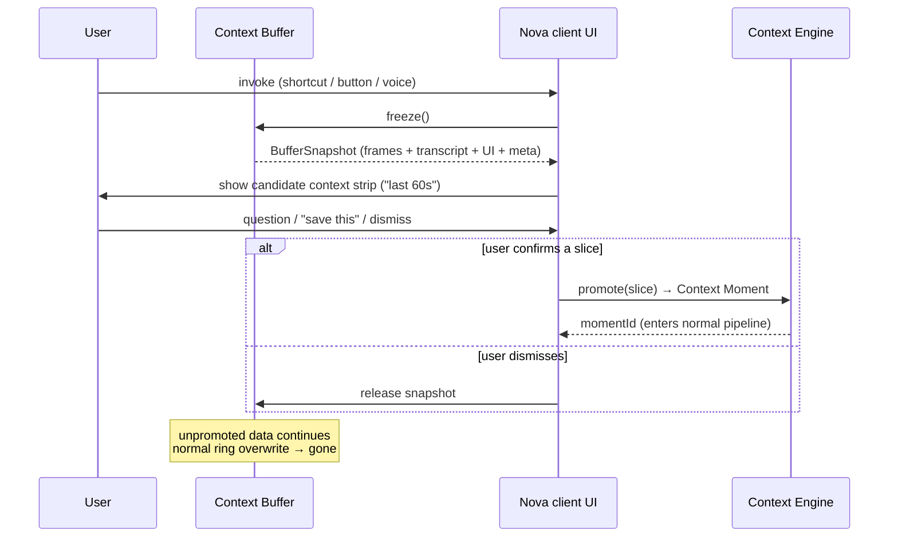

# Context Buffer — Design and Privacy Model

**Why this document:** The Context Buffer is the most privacy-sensitive component in Nova. It is the piece that, done wrong, turns Nova into spyware, and done right, is the reason Nova can answer "what did I just see?" without recording anyone's life. This document specifies exactly what the buffer is, what it is not, how it lives and dies, and the guarantees we make. These guarantees are product commitments, not implementation details — changing any of them requires a design review with the same weight as changing the pricing page. Perception details live in [CONTEXT_ENGINE.md](./CONTEXT_ENGINE.md); system placement in [SYSTEM_ARCHITECTURE.md](./SYSTEM_ARCHITECTURE.md); the full security treatment in [SECURITY_AND_PRIVACY.md](./SECURITY_AND_PRIVACY.md).

---

## 1. Purpose: "You Had to Be There"

Valuable context appears fast, changes fast, and disappears fast: the number flashed in a video, the sentence said in a meeting thirty seconds ago, the tweet that scrolled past. By the time the user decides "I need that," it's gone. A screenshot captures the *now*; the moment of value was 20 seconds in the past.

The Context Buffer solves exactly this: a short, local, rolling window — **the 60 seconds before invocation** — so that when the user invokes Nova, the recent past is available as *candidate* context. That's the whole job. Everything else in this document is about doing that job without becoming surveillance.

## 2. What It Is NOT

State these plainly, because the failure modes are catastrophic:

- **Not surveillance.** The buffer does not exist unless the user turned it on for this surface, this session. There is no background service quietly watching.
- **Not always-on recording.** No wake-on-anything, no ambient capture, no "we buffer just in case." This is an ethics requirement and simultaneously a platform-policy requirement — App Store and Play Store both reject covert recording, and we would deserve it.
- **Not uploaded wholesale.** Buffer contents never leave the device as a blob. Ever. Only user-confirmed slices, promoted explicitly into a Context Moment, enter storage or sync ([CONTEXT_ENGINE.md](./CONTEXT_ENGINE.md) §10).
- **Not storage.** Nothing in the buffer is durable. It is a perception aid with the lifetime of a session, not a memory tier.

The five guarantees, referenced throughout this document and tested as invariants (§13):

| # | Guarantee | Where specified |
|---|---|---|
| G1 | The buffer exists only when the user explicitly enabled it, and is always visibly indicated | §3 |
| G2 | Buffer contents never leave the device except as user-confirmed promoted slices | §5 |
| G3 | All contents are destroyed by overwrite or purge within the window/session lifetime | §6 |
| G4 | Any disk spill is unreadable once the in-memory key is discarded | §7 |
| G5 | Secure surfaces and denied apps/sites never enter the buffer at all | §10 |

## 3. Lifecycle

```mermaid
stateDiagram-v2
    [*] --> Off: default
    Off --> Buffering: user enables (per surface, per session)
    Buffering --> Buffering: ring overwrite (continuous)
    Buffering --> Invoked: user invokes Nova
    Invoked --> Buffering: user confirms/discards slices
    Buffering --> Purged: session end / surface close /<br/>screen lock / timeout / panic gesture
    Invoked --> Purged: same triggers apply
    Purged --> Off
    note right of Purged: full zeroize + key discard;<br/>nothing survives process death
```



- **Opt-in, per surface, per session.** The user explicitly enables buffering for a tab, an app, or a live session. Enabling once is not enabling forever: a new session starts from Off. Live Context Mode sessions are additionally bounded (MVP: 30 min hard stop).
- **Visible persistent indicator, every platform, no exceptions.** If the indicator can't render, the buffer doesn't run — indicator failure is a purge trigger, not a cosmetic bug.

| Platform | Nova's indicator | OS-provided indicator (alongside, never suppressed) |
|---|---|---|
| Browser extension | toolbar badge (recording state) + in-page pill on the buffered tab | Chrome's tab-capture indicator on the tab strip |
| Desktop (Tauri) | menu-bar / tray icon state + optional screen-edge glow | macOS 15+ purple screen-recording indicator and recurring re-consent; Windows capture border |
| Android | ongoing notification + status-bar dot | MediaProjection's persistent notification (OS-required) |
| iOS (ReplayKit) | in-broadcast overlay | iOS red status-bar broadcast indicator |
- **RAM or encrypted temp only.** Preferred: everything in process memory. If the platform forces a spill (mobile memory pressure), spill is encrypted with an ephemeral key (§7).
- **Ring buffer.** Fixed-capacity circular structure; default window **60 seconds**, user-configurable up to **5 minutes**. Writing slot N+1 destroys slot N−capacity. Overwrite *is* the deletion mechanism — the common case requires no cleanup code to run.

The ring is a fixed array allocated once at session start, sized from window length × frame rate:

```ts
interface BufferSlot {
  seq: number;                    // monotonic; slot index = seq % capacity
  capturedAt: number;             // session-clock ms
  frame?: EncodedFrame;           // downscaled JPEG/WebP bytes (or ciphertext ref if spilled)
  uiSnapshotRef?: number;         // index into the (smaller) UI-snapshot ring
  transcriptSegs: TranscriptSeg[];// ASR segments that closed during this slot's window
  meta: { app: string; url?: string; title?: string };
  isKeyframe: boolean;
}

class ContextBuffer {
  private slots: (BufferSlot | null)[];   // fixed capacity, allocated once
  private key: Uint8Array | null;         // ephemeral spill key; null when purged
  write(slot: BufferSlot): void;          // overwrites slots[seq % capacity]
  freeze(): BufferSnapshot;               // copy-on-read view for invocation (§5)
  purge(reason: PurgeReason): void;       // zeroize all slots, discard key, emit audit event
}
```

`purge()` is idempotent, synchronous, and takes no locks that capture holds — it must succeed even if the capture loop is wedged. A watchdog re-invokes it if any purge trigger fired without the buffer reaching the purged state within 2 seconds.

### 3.1 Per-Platform Implementation Notes

Same design, different plumbing — and the plumbing constraints are real:

| Platform | Where the ring lives | Platform-specific constraints |
|---|---|---|
| Browser extension (MV3) | offscreen document (long-lived), not the service worker | MV3 service workers are killed at will; buffer state must never depend on worker lifetime. `tabCapture` requires a user gesture — which aligns exactly with our opt-in rule. Buffer scope is the tab, nothing else. |
| Desktop (Tauri v2) | Rust core process memory | capture loop in Rust (ScreenCaptureKit / Graphics.Capture bindings); the webview UI never holds frame bytes, only thumbnails for the candidate strip. `mlock` for the spill key. |
| Android | foreground service (required for MediaProjection) | OS may still kill the service under pressure — acceptable: death = purge by definition (§6). Ring sized to the 60 MB budget; spill to `cacheDir` ciphertext only. |
| iOS | ReplayKit broadcast extension only | ~50 MB OS cap, no general observation of other apps ([CONTEXT_ENGINE.md](./CONTEXT_ENGINE.md) §12). Frames drop first under the cap; transcript survives. |

Note on Instant Capture: when the buffer happens to be enabled at invocation time, Instant Capture's "recent buffer" candidate context comes from this same ring via the same freeze/promote path (§5). When the buffer is off, Instant Capture is strictly present-tense — the visible frame and DOM at invocation. There is no hidden mini-buffer behind Instant Capture; that would be the covert recording we promised not to build.

## 4. Contents

Each ring slot is a timestamped bundle:

| Component | Detail |
|---|---|
| Sampled frames | ~1 fps (0.5 fps under pressure), downscaled to ≤1280px long edge, JPEG/WebP q≈60. Keyframe flag on scene change. |
| Rolling audio transcript | Only if audio is enabled for the session. Streaming ASR segments with timestamps, channel-tagged user vs. media. Raw audio ring is kept only as far back as ASR needs (~10s), not the full window. |
| UI/DOM snapshots | Normalized `UIElement` trees ([CONTEXT_ENGINE.md](./CONTEXT_ENGINE.md) §6), captured on significant DOM mutation rather than per-frame — they compress far better than pixels and carry most of the meaning. |
| App metadata | Active app/URL/title per slot; cheap and always present. |

Sensitive-surface exclusions apply *at write time*, before data enters the ring (§10) — the buffer never holds what the denylist forbids.

## 5. Invocation Behavior



When the user invokes Nova during a buffered session:

1. The buffer is **frozen** (ring writes continue into new slots; the frozen snapshot is what's presented).
2. Nova shows the buffer contents to the user as **candidate context** — a scrubbable strip of frames + transcript, clearly bounded ("the last 60 seconds").
3. The user (or their question) selects a slice. In Live Context Mode, Nova answers grounded in the frozen snapshot; if the user says **"save this,"** the selected slice is promoted.
4. **Only user-confirmed slices are promoted** into a Context Moment — at that point, and only then, the data enters the normal pipeline (structuring, storage, sync per privacy tier).
5. **Everything not promoted is discarded** with the normal ring lifecycle. Declining to save must cost the user nothing and leave nothing behind.

The promotion boundary is the single most important line in Nova's privacy story: *ephemeral perception* on one side, *consented memory* on the other. Code-wise it is one function with one caller, heavily tested, and the only path from buffer to storage.

## 6. Deletion Policy

Deletion is the default state; retention is the exception.

- **Continuous overwrite** by the ring — data older than the window is destroyed by normal operation, hundreds of times per session.
- **Full purge** (zeroize slots, discard key, free memory) on any trigger below.
- **Nothing survives process death.** RAM contents die with the process by definition; any encrypted spill file is unreadable after crash because its key lived only in memory (§7), and stale spill files are unlinked on next startup as garbage, not recovered.

| Purge trigger | Detection | Latency target |
|---|---|---|
| Session end | user stop action, or hard cap (MVP: 30 min) | immediate |
| Surface close | tab closed / navigated away, app quit, window destroyed | immediate |
| Screen lock | OS lock notification (all platforms provide one) | < 1 s |
| Inactivity timeout | no invocation for N min (default 10) | at timeout |
| Panic gesture — **"Nova forget"** | voice command, shortcut, or button | immediate, no confirm dialog |
| Watchdog | any trigger fired but purge not confirmed | 2 s sweep |

The panic gesture deserves emphasis: it purges *first* and confirms *after*. A user reaching for panic is not in a state to click through a dialog, and a confirmation prompt would mean the data survived longer because the user wanted it gone faster.

There is deliberately no "restore buffer" feature. If we could restore it, it wasn't ephemeral.

## 7. Encryption

- **In-RAM is the preferred and default home.** No encryption theater for process memory; the protection is process isolation plus the short lifetime.
- **If spilled to disk** (mobile memory pressure, or desktop configurations where the ring exceeds the RAM budget): every session generates a fresh ephemeral key (XChaCha20-Poly1305), held **in memory only** — never keychain, never disk, never synced. Spill files are ciphertext chunks named by slot index.
- **Key discarded = data unrecoverable.** Purge is therefore O(1): drop the key, then unlink files opportunistically. Even if unlink is interrupted (crash, power loss), what remains on disk is noise.
- Keys are held in locked pages where the OS allows (`mlock`/`VirtualLock`) to keep them out of swap.

Key lifecycle, end to end:

1. Session enable → generate 256-bit key from the platform CSPRNG; `mlock` the page.
2. Spill event → encrypt chunk (slot index as AAD, random nonce per chunk), write ciphertext.
3. Read-back (freeze/scrub) → decrypt in memory; plaintext never re-written to disk.
4. Any purge trigger → zeroize the key bytes, then zeroize slots, then unlink spill files.
5. Process death at any step → key is gone with the process; remaining ciphertext is noise.

There is deliberately no key escrow, no key sync, and no "recover my session" path. Support tickets asking us to recover buffer data get the same answer the subpoena does (§12): the data does not exist.

**Buffer and the Developer Platform:** third-party clients have *no* buffer access — no scope grants it, no SDK method exposes it, and the invocation UI that shows candidate context is first-party client code only. An assistant integrating Nova receives context exclusively as promoted Context Moments through `context:read` ([API_AND_SDK_SPEC.md](./API_AND_SDK_SPEC.md)). This is structural, not policy: the ring lives in a process the platform surface cannot reach.

## 8. Memory Limits

Hard caps, enforced by the ring allocator, not by hope:

| Platform | RAM budget | Behavior at cap |
|---|---|---|
| Desktop (Tauri) | ~150 MB | drop-oldest; then reduce fps to 0.5; then reduce JPEG quality |
| Browser extension | ~100 MB (within tab/extension process limits) | same ladder; MV3 service-worker state kept minimal, ring lives in an offscreen document |
| Android | ~60 MB | aggressive ladder; below 40 MB available system-wide, buffer suspends with a visible state change |
| iOS (ReplayKit broadcast only) | ~50 MB (OS-imposed on broadcast extensions) | transcript + metadata prioritized over frames; frames drop first |

Napkin math that shapes the defaults: 60 slots (60s @ 1fps) × ~80 KB per downscaled q60 JPEG ≈ 5 MB of frames; UI snapshots and transcript are noise next to that; the 5-minute maximum window at 1 fps is ~25 MB of frames — comfortably inside every budget, which is why 5 minutes is the ceiling. The budgets exist for headroom (decode buffers, ASR state) and for the pathological cases (high-entropy frames that compress badly).

**Quality tradeoffs, explicitly:** downscaling to 1280px and q≈60 costs us small-text legibility in frames — acceptable because OCR runs at capture time on the *full-resolution* frame before downscaled storage in the ring, and DOM/UI snapshots carry exact text anyway. Under pressure we drop *oldest first*, because the recent past is the product.

The degradation ladder, in order (each step is visible in the buffer status UI):

| Step | Action | Approx. saving | User-visible cost |
|---|---|---|---|
| 1 | drop oldest slots beyond 75% of window | up to 25% of frame bytes | shorter lookback |
| 2 | halve frame rate (1 → 0.5 fps) | ~50% of new frame bytes | coarser scrubbing |
| 3 | reduce JPEG quality (60 → 45) | ~30% of new frame bytes | softer frames |
| 4 | frames off; keep transcript + UI snapshots + metadata | ~95% | text-only candidate context |
| 5 | suspend buffer, visible state change | 100% | buffer paused |

Step 4 matters: even frameless, the buffer still answers "what did she just say?" and "what was that link?" — the two most common recall questions. We degrade toward text, not toward silence.

## 9. Battery Optimization (Mobile)

- **Capture only while screen is on and buffering is explicitly enabled.** Screen off = purge trigger (§6) — there is nothing to capture and no reason to hold data.
- **Adaptive frame rate**: 1 fps baseline; drop to 0.5 or 0.25 fps when the perceptual-hash delta shows a static screen (reading a doc ≠ watching a video); snap back on change.
- **Batch processing**: OCR and UI-snapshot work is batched on a coarse timer aligned with other wakeups, not per-frame, to keep the SoC in low-power states.
- **Suspend on low battery**: below 20% (following the OS saver signal), the buffer suspends with a visible state change and a one-tap re-enable. Nova must never be the reason the phone died.

Power budget target: a 30-minute buffered session on a mid-range Android device should cost under 3% battery beyond the user's own screen-on cost. The dominant draws are MediaProjection frame delivery and ASR; the mitigations above exist because 1 fps capture is nearly free but naive per-frame processing is not. We measure this in CI-adjacent device-lab runs, per release, on a fixed device set — battery regressions are treated like crash regressions.

Desktop is not exempt: on laptops, the capture loop must not prevent package C-states. Same techniques, looser budget (<5% per hour on battery), same measurement discipline.

## 10. User Consent and Surface Controls

- **First-run consent flow**: before the buffer can ever be enabled, a dedicated flow explains — in product language, not legalese — what the buffer holds, where it lives (this device), its lifetime (seconds to minutes), and the promotion rule (§5). Four screens, each one idea:
  1. *What it is* — "Nova can keep the last 60 seconds of this screen, on this device, so you can capture things you just saw."
  2. *What it isn't* — "Nothing is uploaded or saved unless you explicitly save it. The buffer erases itself continuously."
  3. *How you'll know* — the indicator, shown live, with the platform's own indicator alongside.
  4. *How to kill it* — the "Nova forget" panic gesture, practiced once before the flow completes.

  Declining leaves Instant Capture fully usable; the buffer is severable.
- **Per-app / per-site allowlist and denylist**: users choose between "buffer only where I've allowed" (allowlist mode, the shipped default) and "buffer anywhere except…" (denylist mode). Enforcement is at ring-write time — denied surfaces produce no slots, not redacted slots.
- **Auto-excluded secure surfaces**, non-negotiable and not user-overridable: password fields and secure text inputs (detected via UI semantics — `textbox` + secure flag), and a maintained default denylist of banking/financial/health/government login domains. Password managers are denied as a category.
- **OS-level protections — respected, not circumvented:**
  - **Android**: windows flagged `FLAG_SECURE` are rendered blank in MediaProjection output *by OS design*. We respect that: blank frames are detected and dropped (no point ringing black frames), and we will never instruct users to work around FLAG_SECURE.
  - **iOS**: outside a user-initiated ReplayKit broadcast, iOS cannot observe other apps *at all* — so buffer-style capture on iOS exists only within ReplayKit's constraints, and we say so plainly rather than pretending otherwise ([CONTEXT_ENGINE.md](./CONTEXT_ENGINE.md) §12).
  - **macOS 15+**: recurring screen-recording re-consent and the purple indicator are treated as features of our trust story, not friction to minimize.

## 11. Legal Note: Meeting and Call Audio

Recording or transcribing conversation audio is regulated. Several jurisdictions (e.g., California, Illinois, Washington; Germany and others in the EU) require **all-party consent** for recording private conversations, and wiretap statutes can apply to real-time interception, not just stored recordings.

Nova's position: **the user is responsible for obtaining consent; Nova makes that hard to forget.** Whenever live audio is enabled for a session that could plausibly include other people (meeting apps, calls, tab audio with voice), Nova displays a consent reminder at session start stating that recording laws may require informing all participants, with a one-tap way to proceed or to run the session frames-only. The reminder is logged (that it was shown — not the audio) in the user's audit log. This is not legal advice to users and we say so; it is a deliberately prominent guardrail. Enterprise deployments can enforce frames-only policy centrally.

## 12. Threat Model Summary

What the buffer's design protects against, and how:

| Adversary | Protection |
|---|---|
| **Other apps on the device** | Ring lives in Nova's process memory (OS process isolation); spill files are ciphertext with an in-memory key; no IPC surface exposes buffer contents; platform capture permissions (ScreenCaptureKit, MediaProjection) are held by Nova's process alone. |
| **Nova cloud (i.e., us)** | Structurally cannot receive the buffer: no code path uploads ring contents; only the promotion function (§5) emits data, and it emits a user-confirmed Context Moment. Local-only projects never sync even those. We can't leak what we never receive. |
| **Subpoena / legal compulsion** | **Local-only + ephemeral = nothing to produce.** Buffer contents exist for seconds to minutes, on the user's device, unrecoverable after purge. Nova the company holds no buffer data for any user at any time; a demand served on us for buffer contents is answered truthfully with "that data does not exist on our systems." (Promoted Context Moments are user data with normal legal exposure — the buffer's guarantee is precisely that *unpromoted* context never becomes such data.) |
| **Device thief (post-lock)** | Screen lock is a purge trigger; spill keys never touch disk; nothing to extract after lock. |
| **Nova bugs** | The purge paths and the single promotion path are the highest-tested code in the client; purge triggers are belt-and-suspenders (event-driven + watchdog sweep); memory budget breach kills the buffer, never the guarantee. |

What it does *not* protect against, honestly: a compromised OS or kernel-level malware on the user's device can read any process's memory — no application-layer design fixes that. A shoulder-surfer sees what the user sees, buffer or no buffer. And once a slice is promoted, it is governed by the storage and privacy-tier rules in [SYSTEM_ARCHITECTURE.md](./SYSTEM_ARCHITECTURE.md) §4–5, not by this document.

## 13. Verifying the Guarantees

Promises about ephemerality are worthless unless they are tested like invariants:

- **No-upload assertion**: an integration test runs a full buffered session behind a recording proxy and asserts zero bytes of frame/transcript/UI-snapshot content in any outbound request; only the promotion path may emit, and only after simulated user confirmation. This test is release-blocking on every client.
- **Purge tests**: every trigger in §6 is exercised (including SIGKILL mid-session for the process-death case); the test then scans process memory dumps and the temp directory for known plaintext sentinels planted in the ring. Finding a sentinel fails the build.
- **Spill-key test**: force a disk spill, kill the process, assert the spill files fail authenticated decryption with every key material available on disk (there should be none).
- **Indicator coupling**: property test that the buffer's `Buffering` state and the indicator's rendered state can never diverge for more than one frame of the UI loop; indicator render failure must transition the buffer to `Purged`.
- **Denylist enforcement**: fixture pages/apps for each denied category; assert zero slots written, not "slots written then filtered."

These tests are the specification. If a refactor breaks one, the refactor is wrong.

## 14. Alternatives We Rejected

Naming the roads not taken, because each will be re-proposed eventually:

- **Persistent local history (Rewind-style "record everything, search later").** Rejected. It inverts the consent model — retention becomes the default and deletion the chore — and it creates exactly the discoverable archive our threat model exists to avoid (§12). Nova's answer to "search my past" is promoted Context Moments and the Memory Engine, both consented item by item, not a wholesale screen DVR. The cost: we genuinely cannot answer questions about un-promoted moments from yesterday. We accept that cost on purpose; it is the product's spine, not a missing feature.
- **Longer buffer windows (30–60 min).** Rejected above 5 minutes. Past a few minutes, the "recent past" framing becomes fiction — a 45-minute buffer is a recording with extra steps, with meeting-consent implications (§11) that a 60-second window largely avoids. Users who need long-form coverage should start a Live Context session, which is bounded, indicated, and explicitly ended.
- **Uploading the buffer for cloud-side answering in live sessions.** Rejected. Streaming the ring to the cloud for QA convenience would collapse the promotion boundary (§5). Instead, the client ships a minimal grounded slice (current keyframe + relevant transcript span) with each question — more engineering on-device, dramatically smaller trust surface.
- **Persisting the buffer across screen lock "for convenience."** Rejected without discussion. Lock is a purge trigger (§6) precisely because the person who unlocks next may not be the person who enabled the buffer.
- **A silent/discreet indicator mode** (requested, predictably, by users who find the indicator "annoying"). Rejected permanently. The indicator is a commitment to bystanders, not a UI preference of the user.

## 15. Configuration Surface

| Setting | Default | Range / options | Scope |
|---|---|---|---|
| Buffer enabled | off | on/off | per surface, per session |
| Window length | 60 s | 15 s – 5 min | global, per-surface override |
| Frame rate | 1 fps | 0.25 – 1 fps (adaptive) | global |
| Audio transcript | off | on/off (consent reminder when on) | per session |
| List mode | allowlist | allowlist / denylist | global |
| Allow/deny entries | empty / curated secure-site denylist | domains, app IDs | global |
| Inactivity timeout | 10 min | 2 – 30 min | global |
| Suspend on low battery | on (≤20%) | on/off, threshold | mobile |
| Panic gesture | enabled ("Nova forget" + shortcut) | remappable, cannot be disabled | global |
| RAM budget | platform default (§8) | reducible only (users may tighten, not raise past cap) | per device |

Every setting change is recorded in the user-facing audit log — including turning the buffer on, which is the one users most deserve a record of.
