# Context Engine — Perception Design

**Why this document:** The Context Engine is Nova's perception system — the code that turns raw signals (pixels, DOM trees, audio, window metadata) into structured, ranked, retrievable **Context Moments**. Everything downstream — the [Memory Engine](./MEMORY_ENGINE.md), the [Action Engine](./ACTION_ENGINE.md), third-party clients on the [Developer Platform](./API_AND_SDK_SPEC.md) — consumes what this engine produces. If perception is wrong, nothing downstream can fix it. This doc specifies the pipeline stage by stage, with honest notes about what each platform actually allows. System-level placement: [SYSTEM_ARCHITECTURE.md](./SYSTEM_ARCHITECTURE.md). The rolling buffer that feeds Live Context Mode is specified separately in [CONTEXT_BUFFER.md](./CONTEXT_BUFFER.md).

---

## 1. Pipeline Overview

```mermaid
flowchart LR
    subgraph Raw["Raw signals (on-device)"]
        FR["Screen frames"]
        DOM["DOM / accessibility tree"]
        AUD["Audio (mic + media)"]
        META["App / window / URL metadata"]
        UTT["User intent utterance"]
    end
    subgraph Local["Local extraction (on-device)"]
        OCR["OCR"]
        SEG["Layout segmentation +<br/>region classification"]
        UIS["UI semantics normalization"]
        EXTR["App-specific extractors"]
        ASR["ASR + speaker separation"]
    end
    subgraph Struct["Structuring"]
        CM["Context Moment assembly"]
        COMP["Tiered compression"]
    end
    subgraph Serve["Cloud (privacy-tier permitting)"]
        ENR["Enrichment workers<br/>(entities, linking)"]
        EMB["Embedding"]
        RANK["Ranking"]
        RET["Retrieval API"]
        EXP["Expiration"]
    end
    Raw --> Local --> CM --> COMP --> ENR --> EMB --> RANK --> RET
    RET -.-> EXP
```



Principles, in priority order:

1. **Structured beats pixels.** If we can read the DOM or accessibility tree, we do not OCR a screenshot of it. Pixels are the fallback, not the default.
2. **Local first.** Extraction runs on-device. Cloud sees structured, minimized output — never the raw buffer, and never anything from local-only projects.
3. **Perception is event-driven, not continuous.** Heavy work happens on invocation or inside an explicitly started live session. There is no ambient analysis loop.
4. **Every stage degrades independently.** OCR failing doesn't block metadata capture; ASR failing doesn't block frames.

Latency budget for the Instant Capture path — the user pressed a button and is waiting:

| Stage | Where | Budget (p95) | Blocking capture UX? |
|---|---|---|---|
| Frame grab + metadata | device | 150 ms | yes |
| DOM/AX extraction | device | 200 ms | yes |
| Layout segmentation | device | 30 ms | yes |
| OCR (opaque regions only) | device | 800 ms | no — backfills into the moment |
| ASR of intent utterance | device or cloud | 1.5 s after speech ends | no — moment shows "transcribing…" |
| Moment assembly + local persist | device | 100 ms | yes |
| Sync + enrichment + embedding | cloud, async | seconds–minutes | no |

The rule the budget encodes: **the user gets tactile confirmation of capture in under half a second**; everything slower is asynchronous backfill on an already-persisted moment.

---

## 2. OCR

On-device first, per platform:

| Platform | Primary OCR | Notes |
|---|---|---|
| macOS / iOS | Apple Vision (`VNRecognizeTextRequest`) | Fast, accurate, free, fully local. Use `accurate` mode on capture, `fast` mode for live-session sampling. |
| Android | ML Kit Text Recognition v2 | On-device, no network. Good Latin-script accuracy; script packs for CJK. |
| Windows | Windows.Media.Ocr, Tesseract fallback | Windows OCR is decent for UI text; Tesseract (bundled with the Tauri app) for languages it lacks. |
| Browser extension | Usually unnecessary (see below); Tesseract/WASM when needed | WASM Tesseract is slow (~1–3s/frame) and heavier than native — last resort only. |
| Cloud | None by default | Cloud OCR only if a user explicitly re-processes a moment and grants it; local OCR quality is good enough that this is rare. |

**When DOM access makes OCR unnecessary.** In the browser, content scripts read the live DOM: real text, real structure, real links — strictly better than OCR in fidelity and cost. The extension OCRs only what the DOM can't give us: text inside `<canvas>`, `<video>` frames, images without alt text, and cross-origin iframes we can't script. Rule of thumb: in the extension, OCR runs on *regions* the DOM marked as opaque, not on the whole frame.

OCR output is normalized to lines with bounding boxes and confidence scores, then cleaned by an enrichment worker (de-hyphenation, column reflow, confidence-weighted merging with DOM text when both exist for a region).

---

## 3. Screen Understanding

Raw frames are segmented before anything expensive touches them.

- **Layout segmentation**: split the frame into visually coherent regions (fast classical CV — edge density + whitespace projection — not a model; runs in <30ms on device).
- **Region classification**: each region tagged `content` (the thing the user cares about), `chrome` (title bars, toolbars, docks), or `navigation` (menus, sidebars, tab strips). Only `content` regions get OCR/vision by default; `chrome` and `navigation` feed app awareness cheaply (window title, active tab).
- **Semantics + pixels fusion**: when a DOM or accessibility tree is available, it is the **preferred** source of structure — element roles, text, and bounds come from the tree, and pixels are used only to fill holes (canvas, video, images). When no tree is available (e.g., a game, a remote-desktop window, a Flutter app with a poor a11y tree), pixels are the only source and the full frame goes through segmentation → OCR → (optionally) vision LLM.

The fusion rule is explicit: **accessibility tree > DOM > pixels**, per region, with provenance recorded on every extracted element so downstream consumers know how trustworthy a text span is.

---

## 4. App Awareness

Knowing *what app and what page* the user is in is cheap and disproportionately valuable — it drives extractor selection, project linking, and allow/denylist enforcement.

Per-platform detection of active app / window / URL / page title:

- **Browser extension**: `chrome.tabs` (URL, title, favicon), `chrome.windows` focus state. Complete and reliable — but only inside the browser.
- **macOS**: `NSWorkspace.frontmostApplication` + Accessibility API for window title; URL from browsers via AppleScript/AX where permitted.
- **Windows**: `GetForegroundWindow` + UI Automation for title; browser URL via UIA patterns.
- **Android**: AccessibilityService provides the foreground package and window content. This is the same permission that draws Play Store policy scrutiny — see honesty notes in §12.
- **iOS**: not available. The companion app knows only what is shared into it.

**App-specific extractors.** Generic extraction leaves value on the table for high-traffic surfaces, so we run a registry of extractors keyed by URL pattern / app ID, each producing surface-specific structured fields:

| Surface | Extractor output |
|---|---|
| YouTube | video ID, title, channel, current timestamp, chapter, caption text near timestamp |
| Twitter/X | tweet ID(s) in view, author handles, tweet text, quoted-tweet chain |
| Instagram web | post/reel ID, author, caption, visible comments |
| Gmail | thread subject, participants, visible message body, labels |
| Google Docs | doc ID/title, visible heading path, selected text |

Registry pattern:

```ts
interface SurfaceExtractor {
  name: string;
  version: string;                       // bumped on any selector/logic change
  matches(meta: SourceMeta): boolean;    // URL pattern or app id
  extract(input: {
    dom?: Document;                      // extension / in-app browser
    ui?: UIElement;                      // normalized tree (§6), any platform
    frame?: Frame;                       // pixels, for opaque regions
    meta: SourceMeta;
  }): Promise<Partial<ContextMoment>>;   // surface-specific structured fields
}

registry.register(youtubeExtractor);     // first match wins
registry.fallback(genericExtractor);     // readability + OCR of opaque regions; always available
```

Extractors are versioned and expected to break — sites change; each ships with a canary fixture test, and failure degrades to the generic path, never to a dropped capture. An extractor that throws is disabled for the session and reported (name + version only, no page content) so we notice breakage before users file bugs. Third-party extractors arrive later via the plugin system ([API_AND_SDK_SPEC.md](./API_AND_SDK_SPEC.md)), sandboxed and permission-scoped — a plugin extractor sees only the surfaces its manifest declares.

---

## 5. Visual Understanding (Vision LLM)

Vision models are powerful and expensive. The routing rule, enforced by the [Intelligence Engine](./INTELLIGENCE_ENGINE.md):

**Vision LLM calls happen only on (a) explicit capture or (b) a user question in a live session. Never continuously.**

- Local heuristics first: if OCR + DOM + extractor output already answer the need (they usually do for text-dominant surfaces), no vision call is made.
- Vision is invoked when the *meaning is in the pixels*: charts, diagrams, photos, screenshots-of-screenshots, visual layout questions ("what's in the third column?"), and video frames.
- One call per moment by default: the best composite (key frame + cropped `content` regions), not N frames × N calls. Live-session questions get the current frame plus at most 2 keyframes from the buffer.
- Cost control is a budget, not a vibe: per-user daily vision-call budget with graceful degradation to OCR-only answers, and per-call downscaling to the model's effective resolution (no point sending 4K).
- Privacy tier is a hard gate: local-only projects may not call cloud vision; they get local heuristics only until on-device VLMs are viable.

---

## 6. UI Semantics

All structural sources (DOM, AX tree, UIA, Android node tree) normalize into one schema so downstream code never branches on platform:

```ts
interface UIElement {
  role: 'button' | 'link' | 'textbox' | 'heading' | 'listitem' | 'image'
      | 'video' | 'tab' | 'menuitem' | 'checkbox' | 'dialog' | 'region' | 'other';
  text: string | null;          // visible text or accessible name
  bounds: { x: number; y: number; w: number; h: number }; // frame coordinates
  states: Array<'focused' | 'selected' | 'checked' | 'disabled' | 'expanded' | 'editable'>;
  source: 'dom' | 'ax' | 'uia' | 'android-a11y' | 'ocr';  // provenance
  confidence: number;           // 1.0 for tree sources, OCR confidence otherwise
  children?: UIElement[];
}
```

Sensitive-role handling happens *here*, before anything is stored: elements with `role: textbox` and password/secure flags, and anything inside surfaces on the user's denylist, are dropped at normalization time — they never reach the Context Moment (details and OS-level protections: [CONTEXT_BUFFER.md](./CONTEXT_BUFFER.md) §10).

---

## 7. Page Analysis

For web content, beyond raw DOM:

- **Readability extraction** (Readability.js-class algorithm in the content script): main article text, stripped of chrome — this becomes the moment's primary `pageText`.
- **Metadata**: OpenGraph/Twitter cards, `<meta>` description, JSON-LD when present.
- **Canonical URL**: `rel=canonical` resolved, tracking parameters stripped (utm_*, fbclid, etc.) — dedup and privacy both improve.
- **Author and publish date**: JSON-LD `author`/`datePublished` first, then meta tags, then heuristic byline extraction. Confidence-scored; never fabricated.

---

## 8. Video Context

Live sessions on video surfaces (YouTube, meetings, screen shares):

- **Frame sampling at 0.5–1 fps** during live sessions — enough to follow slides and scene changes, cheap enough for the buffer budget.
- **Keyframe detection on scene change**: perceptual-hash delta between consecutive samples; a delta above threshold marks a keyframe. Keyframes are what get OCR'd and what a vision call sees; near-duplicate frames are dropped immediately.
- **Transcript alignment**: the audio track's ASR output (§9) is timestamped and aligned to frames, so "what did she say when that chart was up?" resolves to a (keyframe, transcript-span) pair. On YouTube specifically, the extractor prefers platform captions when present — they're better than our ASR and free.

---

## 9. Audio Context

- **ASR pipeline**: MVP uses cloud Whisper-class ASR with explicit disclosure; the companion service later runs whisper.cpp locally, and privacy tier decides which path is allowed. Streaming transcription during live sessions; batch for push-to-talk utterances.
- **Speaker separation, user vs. media**: we do not attempt full diarization at MVP. We separate the two channels we actually have — the user's microphone (push-to-talk) and the media/tab audio — which is a channel split, not a model. Same-channel multi-speaker labeling (meetings) is post-MVP diarization work.
- **Timestamps aligned to frames**: every transcript segment carries `startMs/endMs` on the session clock shared with frame sampling.
- The user's intent utterance is transcribed and stored as a first-class field on the Context Moment — it is the single strongest ranking and linking signal we have.

Consent for media/meeting audio is a legal matter, handled with a visible reminder at session start — see [CONTEXT_BUFFER.md](./CONTEXT_BUFFER.md) §11.

---

## 10. The Context Moment Schema

```ts
interface ContextMoment {
  id: string;                      // ULID
  userId: string;
  createdAt: string;               // ISO 8601
  mode: 'instant_capture' | 'live_session_promotion';
  sessionId?: string;              // set when promoted from a live session

  source: {
    platform: 'extension' | 'desktop' | 'android' | 'ios_companion' | 'sdk';
    app: string;                   // e.g. 'com.google.Chrome', package id, or SDK client id
    url?: string;                  // canonical, tracking-stripped
    pageTitle?: string;
    extractor?: { name: string; version: string };  // which registry extractor ran
  };

  frames: Array<{
    mediaRef: string;              // object-store key (client-side encrypted) or local ref
    capturedAt: string;
    isKeyframe: boolean;
    width: number; height: number;
    ocr: Array<{ text: string; bounds: [number, number, number, number]; confidence: number }>;
  }>;

  ui?: UIElement;                  // normalized semantics root (§6), sensitive fields already stripped
  pageText?: string;               // readability extraction
  pageMeta?: { canonicalUrl?: string; author?: string; publishedAt?: string; description?: string };

  audio?: {
    transcript: Array<{ startMs: number; endMs: number; text: string;
                        speaker: 'user' | 'media'; confidence: number }>;
    mediaRef?: string;             // raw audio, TTL-bound (§13)
  };

  intent: {
    utterance: string | null;      // the user's spoken/typed instruction, verbatim
    transcriptConfidence?: number;
  };

  enrichment?: {                   // filled asynchronously by workers
    summary?: string;
    entities?: Array<{ type: 'person' | 'org' | 'topic' | 'product' | 'place'; name: string; salience: number }>;
    suggestedProjectIds?: string[];
    embeddingRef?: string;         // pgvector row; multiple granularities possible
  };

  privacyTier: 'standard' | 'local_only';
  retention: { rawMediaTtlDays: number; structuredPolicy: 'user_default' | 'project_override' };
  idempotencyKey: string;
}
```

A moment is valid with almost everything optional: metadata + one frame is a legal (if thin) moment. Offline, `enrichment` stays empty until sync.

---

## 11. Compression, Ranking, Retrieval, Expiration

**Tiered compression.** Context is compressed progressively; each tier is cheaper to store and query than the one before:

1. **Raw frames** — short-lived (media TTL, §13); the expensive tier.
2. **Structured extraction** — OCR lines, UI elements, page text, transcript. The workhorse tier; retained per user policy.
3. **Summary** — worker-generated ~100-token summary per moment; ~500-token rollups per session/day.
4. **Embedding** — vectors at moment and segment granularity in pgvector.

Token budgets are enforced at assembly time: a moment presented to an LLM fits a fixed budget (default 2,000 tokens: summary + intent + top-ranked extraction spans), and a retrieval result set fits a caller-declared budget. Compression exists so that "give me context" never means "here are 40 screenshots."

**Ranking.** A moment/segment's relevance score combines:

- **Recency** — exponential decay, half-life tuned per memory layer.
- **Intent match** — similarity between the query/utterance and the moment's intent + summary.
- **Entity overlap with active projects** — moments sharing entities with what the user is working on now rank up.
- **Saliency** — capture-time signals: the user spoke an instruction (strong), dwell time, keyframe density, extractor confidence.

Initial scoring is deliberately simple and inspectable:

```
score = w_r · exp(-Δt / τ)               // recency, τ per memory layer
      + w_i · cos(q_vec, intent_vec)      // intent match
      + w_e · |entities ∩ activeProject|  // entity overlap (capped)
      + w_s · saliency                    // capture-time signal, [0,1]
// starting weights: w_r=0.25, w_i=0.40, w_e=0.20, w_s=0.15
```

Weights are logged per query alongside the returned ranking, so when we have real click/confirmation data the hand-tuned weights become a learned model with an offline evaluation set — not another round of vibes.

**Retrieval.** Hybrid search, one API: Postgres full-text (BM25-class via `tsvector`) + pgvector ANN, candidates merged with reciprocal-rank fusion, then filters (time range, project, source app, privacy tier) applied as SQL predicates. This single retrieval path serves the Memory Engine, Nova's own apps, and third-party callers via `context:read` ([API_AND_SDK_SPEC.md](./API_AND_SDK_SPEC.md)). Local-only projects run the same logic against the on-device SQLite index (FTS5 + local vectors).

```http
POST /v1/context/search
Authorization: Bearer <token with context:read>
{
  "query": "pricing table from that vendor comparison video",
  "filters": { "projectId": "prj_01H...", "after": "2026-06-01T00:00:00Z",
               "sourceApps": ["youtube.com"] },
  "budget": { "maxResults": 8, "maxTokens": 2000 },
  "granularity": "segment"
}
```

```json
{
  "results": [{
    "momentId": "cm_01J...", "segment": { "startMs": 412000, "endMs": 447000 },
    "score": 0.83,
    "summary": "Vendor pricing slide: Acme $12/seat, Beta $9/seat annual…",
    "spans": [{ "source": "ocr", "text": "Acme  $12/seat/mo", "confidence": 0.94 }],
    "frameRefs": ["med_01J..."]
  }],
  "budgetUsed": { "tokens": 1187 }
}
```

Callers declare a token budget and get ranked, pre-compressed context back — never raw media unless they explicitly dereference `frameRefs` (a separate, separately-audited call).

**Expiration.**

| Data tier | Default lifetime | Where enforced |
|---|---|---|
| Context Buffer contents | seconds–minutes (ring overwrite + purge) | on-device only; see [CONTEXT_BUFFER.md](./CONTEXT_BUFFER.md) |
| Raw frames / audio (promoted moments) | 30 days TTL, user-configurable per project | worker sweep over object storage; media row tombstoned first |
| Structured extraction (OCR, UI, transcript text) | retained per user policy | user/project retention setting |
| Summaries + embeddings | live as long as their structured source | deleted in the same transaction as the source row |

- **Buffer purge rules**: the Context Buffer is not storage and never reaches these systems — its lifecycle is continuous overwrite + purge, specified in [CONTEXT_BUFFER.md](./CONTEXT_BUFFER.md).
- **Deletion is real**: row, embeddings, graph edges, and object-store blobs go together in one transaction plus a storage sweep, and the audit log records that a deletion happened (not what was deleted). pgvector living inside Postgres is what makes this a transaction instead of a distributed-consistency chore — see the tradeoff in [SYSTEM_ARCHITECTURE.md](./SYSTEM_ARCHITECTURE.md) §10.

---

## 12. Platform Honesty Notes

What is actually capturable, per platform — the pipeline above silently narrows to what the platform permits:

- **Browser extension (Chromium MV3)** — the best starting point and the MVP. `captureVisibleTab` for frames, `tabCapture` for tab video/audio (requires a user gesture), content-script DOM access (richer than OCR ever will be). Limits: sees only the browser; MV3 service workers die and must recover state; Firefox/Safari ports later.
- **Desktop (macOS/Windows/Linux)** — full-screen capture is real: ScreenCaptureKit + Accessibility API on macOS (both permission-gated; macOS 15+ shows a recurring purple screen-recording indicator and re-consent prompts — we design for that visibility, not around it), Graphics.Capture + UI Automation on Windows. Shipped via Tauri v2.
- **Android** — viable but heavy: AccessibilityService for the node tree and app awareness (real Play Store policy scrutiny; a rejection risk we carry openly), MediaProjection for frames (persistent notification required — good), overlay permission for the floating button. Ships after desktop/extension.
- **iOS** — the honest answer: **no general screen observation of other apps, period.** What exists: share-sheet extension (user pushes content in), ReplayKit broadcast (user-initiated, awkward, ~50MB memory-limited), Shortcuts/App Intents, in-app browser. Full Nova on iOS requires an Apple partnership or an OS change. The iOS app is a *companion* — share-sheet capture, voice notes, memory review — not an observer, and we say so in the product.

---

## 13. Interfaces

The Context Engine exposes three internal interfaces (and their API-layer projections):

- `capture(rawSignals) → ContextMoment` — on-device, synchronous path from invocation to stored moment.
- `retrieve(query, filters, budget) → RankedContext` — hybrid retrieval, used by the [Memory Engine](./MEMORY_ENGINE.md), the web app, and `context:read` API callers.
- `expire()` — TTL sweeps and policy-driven deletion, run by workers.

Everything else in this document is implementation detail behind those three calls.
