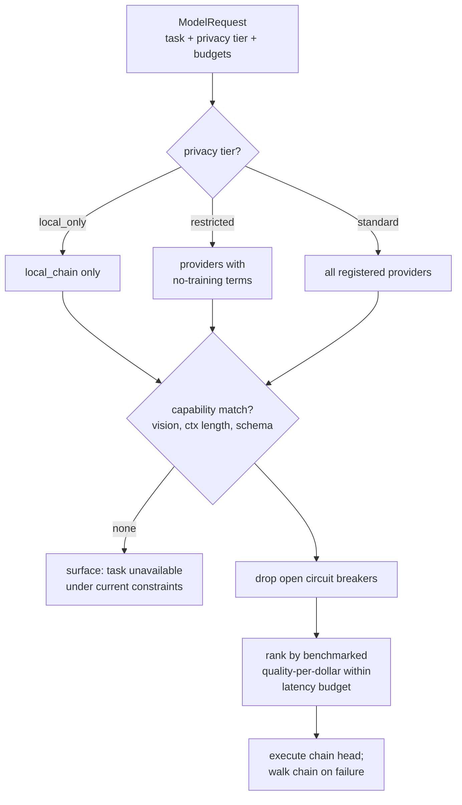

# Intelligence Engine

**Why this document.** The Intelligence Engine is Nova's model orchestration layer: it decides which model handles which task, under what latency, cost, and privacy constraints, and what happens when a provider fails or regresses. This document specifies the task taxonomy, provider registry, routing policy, cost and latency engineering, fallback and consensus behavior, verification, and benchmarking. It sits between the [Context Engine](./CONTEXT_ENGINE.md) (which produces perception inputs), the [Memory Engine](./MEMORY_ENGINE.md) (which it reads and writes), and the [Action Engine](./ACTION_ENGINE.md) (which consumes its structured outputs).

---

## 1. Core stance: models are commodities, context is the moat

Nova must never depend on one model provider. Not as a procurement preference — as an architectural invariant.

The model landscape reprices and reshuffles quarterly. Any system whose behavior is welded to one provider's API inherits that provider's outages, price changes, deprecations, and rate limits as existential risk. Nova is **model-agnostic infrastructure**: every model call goes through `packages/model-router`, every task is defined by its requirements rather than by a model name, and swapping a provider is a configuration change plus a benchmark run — never a code rewrite.

The corollary matters more than the invariant: **Nova's moat is context, not models.** Anyone can call the same frontier models we call. What they cannot replicate is a year of a user's structured, linked, retrievable context. The Intelligence Engine's job is therefore to be excellent plumbing — fast, cheap, reliable, verifiable — and to stay out of the way of the thing that actually compounds.

Practical consequences:

- No provider SDK is imported outside `packages/model-router`.
- Prompts are provider-portable by default; provider-specific optimizations (e.g., prompt caching formats) live behind the router interface.
- Every task type has at least one benchmarked alternative provider at all times (MVP scope: one primary + one fallback, per [MVP_SCOPE.md](./MVP_SCOPE.md)).

## 2. Task taxonomy

Routing starts from what the task *demands*, not which model is fashionable.

| Task type | Latency need | Quality need | Context length | Vision | Notes |
|---|---|---|---|---|---|
| Screen/vision understanding | Medium (2–5s) | High | Medium | **Required** | Frame(s) + OCR + DOM → what is on screen |
| Intent parsing | **Hard <1s** | Medium | Small | No | Utterance → structured intent; cheap-fast tier |
| Summarization | Relaxed (background) | Medium-high | Large | Sometimes | Moment/session summaries; batchable |
| Entity extraction | Relaxed (background) | Medium | Medium | No | Structured output, schema-validated; batchable |
| QA over live context | **First token <2s** | High | Medium | Often | Live Context Mode; grounded in buffer only |
| Research/search | Relaxed (seconds–minutes) | High | Large | No | Search-augmented models or tool-use loops |
| Coding-adjacent | Medium | High | Large | Sometimes | Explaining code on screen, generating snippets |
| Embedding | Batch or <500ms | n/a (consistency) | Small chunks | No | Consistency across corpus > per-call quality |

Two observations drive the whole design. First, **most calls by volume are cheap calls**: intent parsing, extraction, and summarization dominate call count; QA and vision dominate cost per call. Second, **latency and quality needs are anti-correlated across our workload** — the tasks that must be instant (intent parsing) tolerate smaller models; the tasks that need frontier quality (live QA, vision) tolerate a beat of latency. The router exploits both.

## 3. Provider registry

Providers register with declared capabilities; the registry is data, not code.

| Provider | Vision | Reasoning | Long ctx | Speed | Cost | Local | Roles |
|---|---|---|---|---|---|---|---|
| Anthropic Claude (frontier + fast tiers) | strong | strong | yes | fast tier: high | $$–$$$ | no | **Default primary**: vision, QA, reasoning |
| OpenAI GPT (frontier + mini tiers) | yes | yes | yes | mini: high | $$–$$$ | no | **Default fallback**; extraction on mini tier |
| Google Gemini (incl. Flash) | yes | yes | longest | Flash: high | $–$$$ | no | Long-context summarization; secondary fallback |
| Local via Ollama / on-device small models | limited | limited | limited | varies (HW) | ~$0 marginal | yes | **Only** option for local-only projects; simple classification |
| Whisper-class ASR (API or whisper.cpp via companion) | n/a | n/a | n/a | streaming | $ | yes (whisper.cpp) | All speech-to-text |
| Embedding providers (OpenAI `text-embedding-3-small`, Voyage) | n/a | n/a | n/a | batch | cents | partial | All embeddings; see [MEMORY_ENGINE.md](./MEMORY_ENGINE.md#42-model-dimensionality-cost) |
| Search-augmented (Perplexity-style APIs) | no | medium | medium | medium | $$ | no | Research tasks needing fresh web knowledge |
| Future providers | — | — | — | — | — | — | Registry entry + benchmark run + config; no code change |

Specific model IDs live in configuration (§10) and rotate as the market moves; this table describes *roles*, which are stable.

## 4. Routing policy

### 4.1 Rule-based first

MVP routing is a deterministic function — auditable, debuggable, and explainable to users:

```
route(task_type, privacy_tier, latency_budget_ms, cost_budget)
  → ranked provider list
```

1. **Filter by privacy tier** (hard constraint, §4.2).
2. **Filter by capability** (vision task → vision-capable providers only).
3. **Filter by health** (circuit breaker state, §7).
4. **Rank** by benchmark quality-per-dollar within the latency budget; tie-break toward the cheaper tier.
5. Emit ranked list; the executor walks it on failure.



We choose rules over learned routing at MVP because a routing bug in a deterministic table is a one-line diff and an obvious diagnosis; a routing bug in a learned policy is a research project. **Learned routing comes later**, once the benchmark suite (§9) has accumulated enough per-task outcome data to train against — and even then it only reorders within the rule-filtered candidate set, never overrides privacy or capability filters.

### 4.2 Privacy tier is a hard constraint

Three tiers, evaluated before anything else:

| Tier | Meaning | Routing consequence |
|---|---|---|
| `standard` | Default cloud processing | Any registered provider |
| `restricted` | User-flagged sensitive project | Providers with contractual no-training/no-retention terms only |
| `local_only` | Project pinned local-only ([MEMORY_ENGINE.md §7](./MEMORY_ENGINE.md#7-user-control)) | **Local models only. No exceptions.** |

For `local_only` projects, requests route exclusively to on-device/Ollama models **even when quality is visibly degraded**. A small local model will summarize worse, extract entities worse, and answer questions worse than a frontier model — and that is the correct behavior, because the user chose privacy over quality and the system must be incapable of silently overriding that choice. The UI labels degraded-mode results ("processed locally — reduced quality") rather than hiding the tradeoff. If no local model can perform the task at all (e.g., high-quality vision understanding on weak hardware), the honest answer is "this task is unavailable for local-only projects," not a quiet cloud call.

This costs us: local-only users get a worse product, and support will hear about it. We accept that cost because the alternative — any code path where privacy constraints bend for quality — eventually gets exercised, and one such incident destroys the trust the entire platform depends on.

## 5. Cost optimization

Cost discipline is a product requirement: the Free tier is capped and Pro is ~$15/mo (see business model in [BUSINESS_MODEL.md](./BUSINESS_MODEL.md)), so per-user model spend must stay a small fraction of that.

- **Model tiering.** Classification, intent parsing, and entity extraction run on cheap-fast tiers (Claude fast tier, GPT mini tier, Gemini Flash) — these tasks are schema-constrained and verified (§8), so frontier reasoning is wasted on them. Frontier models are reserved for live QA, vision understanding, and multi-moment reasoning. Expected effect: frontier calls are a minority of call volume while remaining the majority of value.
- **Prompt caching.** System prompts, tool schemas, and per-project context preambles are structured to be cache-stable (static prefix, volatile suffix). On providers with prefix caching this cuts input cost on repeated structures by an order of magnitude; the router applies each provider's caching mechanics behind the interface.
- **Context compression before calls.** The Memory Engine returns ranked evidence, and the router packs to a task-specific token budget — summaries instead of raw transcripts, top-k moments instead of whole projects. Sending less is both the cost strategy and, usually, the quality strategy (less distractor text). Default packing budgets:

  | Task | Input budget | Packing rule |
  |---|---|---|
  | Intent parse | ~1k tokens | Utterance + active app/page metadata only |
  | Live QA | ~12k tokens | Buffer transcript window + last N frame descriptions + session Q&A history |
  | Summarization | ~30k tokens | Full transcript chunks, no memory retrieval |
  | Entity extraction | ~8k tokens | Moment summary + OCR text + transcript excerpt |
  | Multi-moment reasoning | ~20k tokens | Top-k fused retrieval results as cited evidence blocks |

- **Batch processing for background enrichment.** Summarization, extraction, and embedding jobs queue in BullMQ and run through provider batch APIs where available (typically ~50% discount) with relaxed latency. Nothing user-facing waits on a batch.
- **Budgets and caps.** Per-user monthly cost budgets tied to plan tier (Free: hard cap that pauses enrichment first, capture last; Pro/Teams: fair-use soft caps with alerts; Enterprise: configurable). Per-tier daily caps protect against runaway loops: any task that exceeds its expected cost profile by 10× trips an alert and a per-task kill switch.

## 6. Latency optimization

Target budgets (p95, measured client-perceived):

| Interaction | Budget |
|---|---|
| Intent parse (utterance → structured intent) | **< 1s** |
| Capture confirmation (moment stored + project suggestion shown) | **< 3s** |
| Live Context Mode answer, first token | **< 2s** |
| Background enrichment | No user-facing budget; queue SLOs only |

How we hit them:

- **Streaming everywhere user-facing.** Every user-visible generation streams. Perceived latency is time-to-first-token; a 2s-first-token streamed answer beats a 5s complete answer in every usability test that has ever been run.
- **Parallel speculative calls — narrowly.** For Live Context Mode QA only, and only when the user's cost budget allows, the router may fire the primary and first fallback simultaneously and stream whichever produces a first token sooner, cancelling the loser. This roughly doubles the cost of those calls, which is why it is *not* used for any background or non-interactive task. It exists because live QA is the moment Nova feels magical or feels broken.
- **Pipeline overlap.** ASR streams partial transcripts; intent parsing starts on the partial rather than waiting for end-of-utterance. Capture confirmation runs project-suggestion and moment-commit concurrently.
- **Edge/regional routing.** Provider endpoints are selected per region where offered; the ingestion API is deployed close to users (Fly.io regions in MVP). Cross-ocean round trips are the dumbest way to lose 300ms.

## 7. Fallback

- **Per-task fallback chains.** Each task type carries an ordered chain (e.g., live QA: Claude frontier → GPT frontier → degraded message). Chains are per-task because the right fallback differs: extraction can fall back to a cheaper model with retry-on-schema-failure; live QA should fall back to an equivalent-quality peer.
- **Health checking.** Passive (rolling error rate and latency per provider from real traffic) plus active (synthetic canary calls every 60s per critical provider).
- **Circuit breakers.** A provider whose rolling 5-minute error rate crosses threshold opens its breaker: it drops out of routing, and half-open probes readmit it after cooldown. This prevents the classic outage pattern of every request eating a 30s timeout before falling back.
- **Graceful degradation messaging.** When all chain entries fail, the user gets an honest state: capture *always* succeeds locally (perception and storage never depend on cloud models — enrichment queues for later), and live QA says "I can't answer right now; your session is still being recorded and saved." Silent failure is prohibited; a wrong-but-confident fallback answer is worse than an honest outage.

Degradation behavior per task when the whole chain is down:

| Task | Behavior during total provider outage |
|---|---|
| Instant Capture | Fully works: moment committed locally with raw content; summary/entities/embedding queue for when providers recover |
| Intent parse | Falls back to keyword heuristics + "review this capture later" default; flagged for re-parse on recovery |
| Live QA | Honest unavailability message; session recording and save-to-moment unaffected |
| Background enrichment | Queue depth grows; alerts fire at SLO breach; drains automatically on recovery |
| Actions | Proposals pause (parameters need models); already-approved actions with fixed payloads still execute |

The invariant behind the table: **the capture path has zero synchronous cloud-model dependencies.** Losing every provider degrades Nova from intelligent to diligent — it never loses user context.

## 8. Consensus and verification

### 8.1 Consensus — reserved for high stakes

Multi-model consensus (N models answer; agree, or a judge model adjudicates) is expensive — 2–3× cost and added latency — and for routine tasks it buys little over single-model + schema validation. So we are explicit: **consensus is reserved for high-stakes outputs only**, and is out of MVP entirely (single primary + one fallback, per [MVP_SCOPE.md](./MVP_SCOPE.md)).

Post-MVP, the qualifying cases are narrow: **Tier 2 action parameter extraction** (anything that messages a human, spends money, or deletes data — see [ACTION_ENGINE.md](./ACTION_ENGINE.md#3-risk-tiers)) and destructive memory operations proposed by a model. There, a second model independently extracts the parameters and a mismatch forces human review. For everything else, consensus is the wrong tool — say no to it by default.

### 8.2 Verification — cheaper than consensus, applied broadly

- **Grounding checks.** Answers about live context must cite buffer evidence: the QA prompt requires span/timestamp references into the Context Buffer transcript or frame descriptions, and a post-check verifies the cited spans exist and the answer's claims are attributable to them. An answer that cannot ground gets rewritten as "I don't see that in the current session" rather than delivered.
- **Schema-validated structured outputs.** Every structured task (intent, entities, action parameters) validates against shared Zod schemas from `packages/schema`. Validation failure → one retry with the validation error in-context → then fallback provider → then surfaced failure. No unvalidated JSON crosses an engine boundary.
- **Hallucination guards on memory writes.** A wrong memory is worse than no memory: it silently corrupts every future answer built on it. Therefore every semantic memory write must carry source-moment citations (enforced at the schema *and* database level — see [MEMORY_ENGINE.md §2.5](./MEMORY_ENGINE.md#25-semantic-memory)), a cheap verifier model checks that the claim is entailed by the cited moments, and low-confidence extractions are stored as unconfirmed and surfaced for user confirmation instead of entering retrieval-ranked memory.

## 9. Benchmarking

You cannot claim model-agnosticism without the machinery to evaluate a swap. The internal eval suite is that machinery:

- **Golden set.** A versioned corpus of real (consented/internal) and synthetic fixtures: screenshots and screen recordings with known contents, utterances with known intents, transcripts with known entities, live-session clips with known-answer questions. Grows with every interesting production failure (failures become fixtures).
- **Regression runs.** The full suite runs on every provider/model version change, every prompt change, and weekly on schedule. A provider updating a model silently *will* shift behavior; we detect it rather than hearing about it from users.
- **Metrics per task type:** quality score (exact-match for structured tasks; rubric/judge scoring for generative ones), latency p50/p95, cost per task.
- **Auto-demotion.** A provider regressing beyond threshold on a task is automatically demoted in that task's ranking (with an alert to us) until a passing run restores it. Humans review; the system doesn't wait for them.

Prompts are part of the benchmarked surface. Every prompt template lives in the repo (`packages/model-router/prompts/`), versioned and code-reviewed like code; a prompt change without a green eval run does not merge. This sounds heavyweight and is the opposite: it is what makes prompt iteration *fast*, because anyone can change a prompt confidently instead of fearing invisible regressions in a task they don't own.

Fixture shape, for concreteness:

```jsonc
// evals/fixtures/intent_parse/0142.json
{
  "input": {
    "utterance": "save this and remind me to compare it with the other two laptops this weekend",
    "page_meta": { "url": "https://store.example/laptop-x", "title": "Laptop X — 14\" ..." }
  },
  "expected": {
    "intents": [
      { "kind": "capture", "link_hint": "existing_project" },
      { "kind": "reminder", "when": "weekend", "action_hint": "compare_items" }
    ]
  },
  "scoring": "structural_match",   // exact fields, order-insensitive
  "provenance": "prod_failure_2026-06-03"  // failures become fixtures
}
```

The suite is small on purpose at first (target: ~150 fixtures per task type by beta) — a curated set we actually maintain beats a large set nobody trusts.

### 9.1 A worked example: one capture, end to end

To make the routing concrete, a single Instant Capture on a `standard`-tier project touches models like this:

| Step | Task type | Routed to | Latency | Cost class |
|---|---|---|---|---|
| Push-to-talk audio → text | ASR | Whisper-class API (streaming) | streaming | ¢ |
| Utterance → structured intent | Intent parse | Claude fast tier | <1s | ¢ |
| Frame + DOM → screen understanding | Vision | Claude frontier | 2–4s (async of confirm) | $ |
| Project suggestion | Classification | Claude fast tier | <1s | ¢ |
| — user sees capture confirmation here (<3s) — | | | | |
| Moment summary | Summarization | batch, Gemini Flash or GPT mini | background | ¢ |
| Entity extraction | Extraction | batch, GPT mini | background | ¢ |
| Embedding | Embedding | text-embedding-3-small | background | ~0 |

One frontier call, everything else on cheap tiers or batch — that ratio is the cost model working as designed.

## 10. Configuration example

Routing is data. Abridged `model-router` config:

```yaml
# packages/model-router/config/routing.yaml
providers:
  anthropic:
    models:
      frontier: { id: claude-frontier-latest, vision: true, ctx: 200k }
      fast:     { id: claude-fast-latest,     vision: true, ctx: 200k }
  openai:
    models:
      frontier: { id: gpt-frontier-latest, vision: true, ctx: 128k }
      mini:     { id: gpt-mini-latest,     vision: true, ctx: 128k }
  ollama:
    endpoint: http://127.0.0.1:11434
    models:
      local_small: { id: llama-small, vision: false, ctx: 8k, local: true }

tasks:
  intent_parse:
    latency_budget_ms: 1000
    output_schema: IntentSchema          # Zod, from packages/schema
    chain: [anthropic.fast, openai.mini]
    local_chain: [ollama.local_small]    # used when privacy_tier == local_only
    retries_on_schema_failure: 1
  live_qa:
    latency_budget_ms: 2000              # first token
    grounding: required                  # §8.2 — must cite buffer evidence
    chain: [anthropic.frontier, openai.frontier]
    speculative_parallel: budget_gated   # §6 — Live Context Mode only
    local_chain: []                      # unavailable local-only; surface honestly
  entity_extraction:
    batch: true
    output_schema: EntityExtractionSchema
    chain: [openai.mini, anthropic.fast]
    local_chain: [ollama.local_small]
  embedding:
    provider: openai.text-embedding-3-small   # swappable; re-embed plan in MEMORY_ENGINE.md
```

The TypeScript surface consumed by the rest of the system:

```ts
// packages/model-router/src/router.ts
export interface ModelRequest<T> {
  task: TaskType;
  privacyTier: "standard" | "restricted" | "local_only";
  input: TaskInput;               // packed context, already budget-compressed
  schema?: z.ZodType<T>;          // structured tasks
  userBudget: BudgetContext;      // plan-tier caps (§5)
}

export interface ModelResponse<T> {
  output: T;
  provider: string;               // recorded in audit + benchmarks
  grounding?: GroundingReport;    // live QA
  cost: { inputTokens: number; outputTokens: number; usd: number };
  latencyMs: { firstToken?: number; total: number };
}
```

Every response records which provider produced it — that provenance flows into action audits ([ACTION_ENGINE.md §10](./ACTION_ENGINE.md#10-audit)) and memory item metadata, so "which model wrote this" is always answerable.

## 11. What we deliberately did not build

- **No learned router at MVP** — deterministic rules until benchmark data justifies otherwise (§4.1).
- **No routine consensus** — verification is the broad tool; consensus is the scalpel (§8).
- **No offline local LLM in MVP** beyond trivial local embeddings and the local-only escape hatch — shipping a great cloud-routed experience first, per [MVP_SCOPE.md](./MVP_SCOPE.md).
- **No fine-tuning on user data.** It would couple us to a provider, complicate deletion guarantees, and violate the no-monetization-of-user-data commitment. Context in, at inference time, under user control — that is the whole model.
