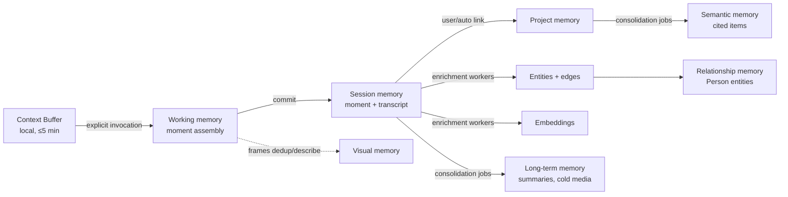

# Memory Engine

**Why this document.** The Memory Engine is where Nova Context stops being a capture tool and becomes infrastructure. This document specifies the layered memory model, the knowledge graph, the embedding and retrieval strategy, versioning, forgetting, and the user-control surface. It is the contract that the [Context Engine](./CONTEXT_ENGINE.md) writes into, the [Intelligence Engine](./INTELLIGENCE_ENGINE.md) reads from, and the [Action Engine](./ACTION_ENGINE.md) grounds actions in. Schema details align with [BUILD_PLAN.md](./BUILD_PLAN.md); access control and data-handling rules are governed by [SECURITY_PRIVACY_GOVERNANCE.md](./SECURITY_PRIVACY_GOVERNANCE.md).

---

## 1. Memory is not storage

Storage answers "where are the bytes." Memory answers "what does the user know, and can we bring the right piece of it back at the right moment." Every design decision below is retrieval-first: we optimize for the query we will run in six months, not for the write we do today.

Memory in Nova is the combination of four properties:

1. **Context** — a Context Moment is stored with everything around it: the app, the page, the project, the spoken intent, the time. A screenshot without these is a dead pixel grid; a moment with them is evidence.
2. **Structure** — moments are linked to entities (people, projects, topics, sources) so that memory can be traversed, not just searched.
3. **Retrievability** — everything that should be findable is embedded, indexed for full-text search, and reachable through the graph. If it can't be retrieved, it effectively wasn't remembered.
4. **Lifecycle** — memory decays, consolidates, and can be deliberately forgotten. A memory system without forgetting is a liability, not a feature.

The failure mode we are engineering against is the screenshot folder: 4,000 images, zero recall. The success criterion is: "what did that pricing page say, the one I captured during the vendor call in March?" answered in under two seconds with the source attached.

## 2. Memory layers

Seven layers, each with a distinct purpose, retention policy, and storage location. Layers are not silos — a fact typically enters at the bottom (working) and, if it matters, ascends.

| Layer | Purpose | Lives in | Retention |
|---|---|---|---|
| Working | Current invocation state | Process RAM (client + worker) | Minutes |
| Session | One capture or live session | Postgres, session-scoped | Hours–days |
| Project | Everything linked to a project | Postgres + object storage | Life of the project |
| Relationship | People and interactions with them | Postgres (entities + edges) | Until user deletes |
| Semantic | Distilled facts, preferences, patterns | Postgres `memory_items` | Long-lived, versioned |
| Visual | Deduplicated visual fingerprints | Postgres + object storage | Frames expire; descriptions persist |
| Long-term | Consolidated, compressed archive | Postgres + cold object storage | Indefinite, tiered |

### 2.1 Working memory

- **Purpose:** the scratch state of the current invocation — the frames just promoted from the Context Buffer, the partial transcript, the intent being parsed, the candidate project links.
- **Contents:** in-flight Context Moment under assembly, live-session rolling state (Live Context Mode Q&A history for this session), model call intermediates.
- **Retention:** minutes. It dies with the process or the invocation. Nothing here is durable by design — durability happens only when a moment is explicitly committed.
- **Example:** during a Live Context Mode session on a YouTube tutorial, the last 60 seconds of transcript plus the two questions the user already asked live here so the third question ("what was that flag again?") can be answered without a database round trip.

### 2.2 Session memory

- **Purpose:** the durable record of one capture event or one bounded live session, before consolidation.
- **Contents:** the committed Context Moment(s), the full session transcript (Live Context Mode), the answers Nova gave during the session, the actions proposed.
- **Retention:** hours to days in "hot" form. A background job (BullMQ, see §7) consolidates sessions: transcripts are summarized, entities extracted, embeddings written, and the raw session state demoted.
- **Example:** a 25-minute live session over a webinar produces one session record containing 25 minutes of transcript, three saved Context Moments, and four Q&A exchanges. Two days later the transcript is chunked, summarized, and embedded; the session record becomes an index into its moments rather than a hot blob.

### 2.3 Project memory

- **Purpose:** the unit of *organized* memory. Users think in projects ("apartment hunt," "Q3 launch," "learn Rust"); memory that maps to projects is memory that gets used.
- **Contents:** all Context Moments linked to the project, project-scoped entities and decisions, project timeline, open tasks and follow-ups, generated documents.
- **Retention:** as long as the project lives. Archiving a project moves its media to cold storage and lowers its retrieval weight but deletes nothing; deleting a project triggers the hard-delete cascade (§6).
- **Example:** the "apartment hunt" project holds 14 moments (listings, a mortgage calculator screen, two broker chats), a comparison table Nova generated, and a decision record ("passed on Elm St — noise"). Six weeks later, "why did we skip the Elm Street place?" resolves through project memory even though the listing page is long gone.

### 2.4 Relationship memory

- **Purpose:** remember *people* — who they are, where the user encountered them, what was discussed, what was promised.
- **Contents:** Person entities with role/affiliation, edges to the moments where they appeared (`MENTIONED_IN`, `PARTICIPATED_IN`), discussion summaries, open follow-ups ("send Maya the deck"). **Provenance is always kept**: every claim about a person carries the moment(s) it came from.
- **Retention:** until the user deletes the person or the sourcing moments. Deleting all sourcing moments deletes the derived claims — a claim may not outlive its evidence.
- **Explicitly not:** social scoring. Nova stores no ranking, rating, sentiment score, or "relationship strength" metric about people. That is a product line we refuse, not a backlog item. The distinction matters legally (profiling under GDPR) and ethically; see [SECURITY_PRIVACY_GOVERNANCE.md](./SECURITY_PRIVACY_GOVERNANCE.md).
- **Example:** "Maya Chen — met in the March 12 vendor call (moment #1042), discussed SSO timeline, follow-up: she owes us the security questionnaire." Asking "who was the SSO person at Vendly?" retrieves Maya with the sourcing moment one click away.

### 2.5 Semantic memory

- **Purpose:** distilled facts, preferences, and patterns extracted *across* moments — the layer that makes Nova feel like it knows the user rather than merely storing their history.
- **Contents:** `memory_items` of kind `fact`, `preference`, or `pattern`. Every item carries **source-moment citations** — an array of moment IDs that justify it. An item with zero citations cannot exist (enforced at write time; this is the hallucination guard described in [INTELLIGENCE_ENGINE.md](./INTELLIGENCE_ENGINE.md#8-consensus-and-verification)).
- **Retention:** long-lived and versioned. Items are re-validated during consolidation; contradicted items are superseded, not silently edited (§5).
- **Example:** after three separate captures involving flight searches, consolidation writes: `preference: "prefers aisle seats, avoids red-eyes" — sources: [moment 811, 902, 977]`. When the user later captures a booking page, the Action Engine can surface this without the user restating it.

### 2.6 Visual memory

- **Purpose:** make visual context retrievable without hoarding pixels.
- **Contents:** perceptual-hash fingerprints for deduplication (the same dashboard captured 30 times stores one canonical visual plus 30 references), thumbnails, and model-generated descriptions of what each frame shows.
- **Retention:** **raw frames expire, descriptions persist.** Full-resolution frames follow the retention policy of their data class (§6.3); thumbnails and text descriptions live as long as the moment does. The bet: 18 months later, "the graph with the blue spike" is answered by the description + thumbnail, and the full frame is rarely missed. The cost of being wrong is a degraded answer; the cost of keeping everything is unbounded storage and an unbounded breach surface. We take the first cost.
- **Example:** a user captures the same Grafana dashboard daily. Visual memory stores one fingerprint, one description ("latency dashboard, p99 panel top-right"), and per-capture deltas ("p99 spiked to 900ms on the 14th").

### 2.7 Long-term memory

- **Purpose:** keep old context useful and cheap.
- **Contents:** consolidated summaries, compressed session records, re-embedded content.
- **Mechanism:** **consolidation jobs — Nova's sleep.** Scheduled BullMQ jobs that (a) summarize clusters of related moments into higher-level records, (b) extract/refresh semantic memory items, (c) recompute decay scores, (d) re-embed content when the embedding model changes (old vectors are useless against a new model's query vectors — re-embedding is a planned, batched migration, not an emergency), and (e) demote cold media to archival object storage.
- **Retention:** indefinite, in progressively cheaper and coarser tiers, until decay or user action removes it.
- **Example:** 40 moments from a finished "conference trip" project consolidate into one trip summary, eight semantic items, and archived media. Retrieval quality for "who did I meet at the conference?" stays high; storage cost drops ~90%.

### 2.8 How a moment moves through the layers



Enrichment (entity extraction, embedding, linking) runs asynchronously on BullMQ workers after commit — capture latency never waits on it. A moment is retrievable by FTS within seconds of commit and by vector/graph retrieval within the enrichment SLO (target: under one minute at p95).

Consolidation cadence:

| Job | Schedule | Work |
|---|---|---|
| Session consolidation | Nightly, sessions > 48h old | Chunk + summarize transcripts, demote raw session state |
| Semantic extraction | Nightly, per active project | Extract/refresh cited facts, preferences, patterns |
| Decay recompute | Weekly | Update decay scores; mark archival candidates |
| Media demotion | Weekly | Expire raw frames/audio per data class; move cold media |
| Re-embedding | On embedding-model change only | Batched migration, oldest-first, dual-read during cutover |

## 3. Knowledge graph

The graph is what turns retrieval from "search my stuff" into "traverse my world."

### 3.1 Entity types

`Person`, `Project`, `Topic`, `Source` (a website, channel, feed, or publication), `App`, `Document`, `Product`, `Decision`, `Task`.

These nine cover the MVP and the 12-month roadmap. New types are added by migration, not free-form — a typed graph stays queryable; a free-form one becomes a junk drawer.

### 3.2 Edge types

| Edge | Example |
|---|---|
| `MENTIONED_IN` | Person "Maya Chen" → Moment #1042 |
| `BELONGS_TO` | Moment #1042 → Project "Vendor eval" |
| `ABOUT` | Moment #1042 → Topic "SSO" |
| `CAPTURED_FROM` | Moment #1042 → Source "vendly.com" / App "Chrome" |
| `PRODUCED` | Moment #1042 → Task "Chase security questionnaire" |
| `DECIDED_IN` | Decision "Chose Vendly" → Moment #1103 |
| `RELATES_TO` | Product "Vendly SSO" → Topic "SAML" (weighted, model-inferred) |
| `FOLLOWS_UP` | Task "Send deck" → Person "Maya Chen" |
| `SUPERSEDES` | Decision v2 → Decision v1 |

Every edge carries `type`, `weight` (0–1 confidence/strength), and `provenance` (which moment or job created it, with which model). Inferred edges (`RELATES_TO`) are distinguishable from asserted ones (`BELONGS_TO` confirmed by the user) — retrieval trusts them differently.

### 3.3 Why Postgres tables, not Neo4j

The graph is two tables — `entities` and `edges` — in the same Postgres 16 instance as everything else.

- **What we gain:** one system of record, real foreign keys from edges to moments (provenance is a constraint, not a convention), transactional writes with moment ingestion, one backup/restore story, one deletion cascade (§6), zero new operational surface for a small team.
- **What we give up:** native graph query language and fast deep traversals. Cypher's `(:Person)-[*1..4]->()` becomes recursive CTEs, which get painful past ~3 hops and awkward for variable-length path queries.
- **Why it's the right trade now:** our access pattern is 1–2 hop expansion around a seed set from vector/FTS retrieval, at single-user graph sizes (10⁴–10⁶ edges). Postgres handles that in milliseconds with plain indexed joins. We will revisit only if a real workload needs 3+ hop traversals at scale — and because the graph is already relational, exporting to a dedicated graph DB later is a batch job, not a rewrite.

## 4. Embeddings and retrieval

### 4.1 What gets embedded

- **Moment summaries** — one vector per moment, over a model-written summary (not raw OCR; OCR noise poisons embeddings).
- **Entity descriptions** — one vector per entity, refreshed when its description changes materially.
- **Transcripts, chunked** — ~400-token chunks with ~15% overlap, each pointing back to its moment and time offset so answers can cite a spot in a session, not just a session.
- Semantic memory items — short, dense, ideal embedding targets.

Raw frames are *not* embedded in MVP (image-embedding cost/benefit is poor at our scale); their text descriptions are.

### 4.2 Model, dimensionality, cost

Default `text-embedding-3-small` (1536d), with Voyage as the swappable alternative behind `packages/model-router` — the embedding provider is a config value, not an architectural commitment. At 1536d float32, one million embedded chunks ≈ 6 GB of vectors; pgvector with HNSW indexes handles this comfortably on a modest instance. Embedding API cost is noise relative to LLM calls (fractions of a cent per moment). The real cost of the choice is *lock-in via re-embedding*: switching models means re-embedding the corpus. We accept that and design consolidation jobs (§2.7) to make re-embedding routine.

### 4.3 Hybrid retrieval

No single signal is sufficient. Vector search misses exact identifiers ("error `ERR_QUIC_PROTOCOL`"), FTS misses paraphrase, both miss structure ("things involving Maya"). Retrieval runs four signals and fuses them:

1. **Vector** — pgvector cosine similarity against the query embedding.
2. **Full-text** — Postgres `tsvector` over summaries, transcripts, OCR text.
3. **Graph expansion** — resolve entities in the query, expand 1–2 hops, boost moments connected to the expanded set.
4. **Recency/decay weighting** — newer and frequently-accessed memory ranks higher, all else equal.

Rough fusion (tuned empirically, not sacred):

```
score = 0.45 * vector_sim
      + 0.20 * fts_rank_norm
      + 0.20 * graph_proximity      # 1.0 direct link, 0.5 one hop, 0.25 two hops
      + 0.15 * recency_decay        # exp(-age_days / half_life), half_life per data class
score *= project_boost              # ×1.5 if the query is executing inside a project context
```

Mechanically: vector and FTS run as parallel Postgres queries returning candidate sets (~top 50 each); entity resolution + graph expansion runs as one or two indexed joins over `edges`; fusion happens in the application layer where the formula is easy to iterate on. A sketch of the graph-expansion leg:

```sql
-- moments connected (≤1 hop) to entities resolved from the query
WITH seed AS (
  SELECT id FROM entities
  WHERE user_id = $1 AND name = ANY($2)          -- resolved entity names
),
hop1 AS (
  SELECT DISTINCT e2.src_entity_id AS id
  FROM edges e1 JOIN edges e2 ON e2.dst_entity_id = e1.src_entity_id
  WHERE e1.user_id = $1 AND e1.src_entity_id IN (SELECT id FROM seed)
)
SELECT DISTINCT dst_moment_id, MIN(hop) AS proximity
FROM (
  SELECT dst_moment_id, 0 AS hop FROM edges WHERE src_entity_id IN (SELECT id FROM seed)
  UNION ALL
  SELECT dst_moment_id, 1 FROM edges WHERE src_entity_id IN (SELECT id FROM hop1)
) x WHERE dst_moment_id IS NOT NULL
GROUP BY dst_moment_id;
```

Top-k fused results go to the Intelligence Engine for answer synthesis with citations. Retrieval returns *evidence*, never prose.

Retrieval quality is measured, not assumed: the eval suite in [INTELLIGENCE_ENGINE.md §9](./INTELLIGENCE_ENGINE.md#9-benchmarking) includes retrieval fixtures (query → expected moments) and tracks recall@k so weight changes to the fusion formula are regressions-tested like any other code.

## 5. Versioning

- **Context Moments are immutable.** A moment is evidence of what was on screen and what was said at a point in time. We never edit evidence.
- **Interpretations are versioned.** Summaries, extracted entities, semantic items, and generated documents are derived data. When a better model or a user correction improves them, we write a **new version** with `supersedes` pointing at the old one. History is queryable; "what did Nova believe on date X" is answerable.
- **User edits are new versions too.** If the user fixes a summary, that becomes the current version flagged `author: user` — user-authored versions outrank model-authored ones and are never overwritten by consolidation.

This costs storage (old versions linger until decay archives them) and buys auditability: when a memory is wrong, we can see when it went wrong and which model wrote it.

## 6. Forgetting

A memory system that only accumulates becomes slower, more expensive, and more dangerous every day. Forgetting is a feature with three mechanisms:

### 6.1 Decay scores

Every memory item and moment carries a decay score updated by consolidation jobs, from age, access frequency, project activity, and graph connectivity. Decay never deletes by itself — it demotes: low scores drop out of default retrieval ranking and become eligible for archival.

### 6.2 Archival tiers

Hot (Postgres + hot object storage, full retrieval weight) → Warm (compressed summaries hot; media in infrequent-access storage) → Cold (summary index only hot; everything else in archival storage, retrieved on demand with seconds of latency, surfaced with an "from archive" marker).

### 6.3 Auto-expiry per data class

| Data class | Default expiry |
|---|---|
| Context Buffer | ≤ 5 min, local only, auto-purged (never uploaded wholesale) |
| Raw full-res frames | 90 days → thumbnail + description only |
| Raw audio | 30 days post-transcription (transcript persists) |
| Session transcripts | Chunked/summarized at consolidation; raw form 180 days |
| Moments, summaries, semantic items, graph | No auto-expiry; decay + user control |

Defaults are user-adjustable per project and globally (§7).

### 6.4 User-initiated forget: hard cascade delete

When the user says forget, we forget — not soft-delete, not tombstone-and-keep:

1. Delete the moment(s) and media objects.
2. Delete **embeddings** for the content and all derived chunks.
3. Delete **graph edges** sourced from those moments; delete entities left with no remaining provenance.
4. Delete or re-derive semantic memory items citing those moments (an item whose only sources are deleted is deleted with them).
5. Purge from **backups within a stated SLA** (30 days — the backup rotation window; we state this to users rather than pretending backups vanish instantly).
6. Write an audit event recording *that* a deletion happened (never *what* was deleted).

This is expensive to implement — which is exactly why it's designed in now. Retrofitting cascade deletion onto a memory system is how companies end up unable to honor their own privacy promises.

## 7. User control

- **Memory browser** — a first-class UI (web app in MVP): timeline of moments, project views, entity pages ("everything involving Maya"), semantic items with their citations. Every item shows *why Nova believes it* and offers edit / correct / forget inline.
- **Export everything** — one action produces a complete archive: Markdown per moment/project plus a machine-readable JSON dump of moments, entities, edges, and memory items (media included, embeddings excluded as model-specific). No lock-in through data hostage-taking; the moat is the ongoing intelligence, not trapped exports.
- **Local-only pinning** — per-project. A pinned project's moments, media, and derived data never leave the device (SQLite + local files); cloud processing is skipped for them, with the quality tradeoff made explicit in the UI. Routing consequences are specified in [INTELLIGENCE_ENGINE.md](./INTELLIGENCE_ENGINE.md#4-routing-policy).
- **Retention settings** — per-class expiry overrides (§6.3), per-project retention, "paranoid mode" preset (aggressive expiry, no raw media retention).

## 8. Privacy boundaries

- **Per-user isolation is structural.** Every table carries `user_id`; every query is scoped through it; application-layer guards are backed by Postgres row-level security. There is no cross-user query path to misuse.
- **No cross-user learning without explicit opt-in.** Nova does not train on, aggregate, or transfer memory across users. Any future federated/aggregate feature requires separate, explicit, revocable opt-in — default is always off.
- **Third-party API sees only scoped, granted memory.** Assistants integrating via the [Nova Developer Platform](./API_AND_SDK_SPEC.md) operate under permission scopes (`memory:read`, `context:read`, …) granted per client by the user, and reads are filterable to specific projects. A calendar assistant granted one project's memory cannot enumerate the user's relationships. Enforcement and audit are specified in [SECURITY_PRIVACY_GOVERNANCE.md](./SECURITY_PRIVACY_GOVERNANCE.md).

## 9. Core schema sketch

Consistent with [BUILD_PLAN.md](./BUILD_PLAN.md) (Drizzle-managed; abridged — indexes, RLS policies, and enum defs omitted here):

```sql
CREATE TABLE users (
  id uuid PRIMARY KEY,
  email text UNIQUE NOT NULL,
  settings jsonb NOT NULL DEFAULT '{}',      -- retention prefs, privacy tier defaults
  created_at timestamptz NOT NULL DEFAULT now()
);

CREATE TABLE projects (
  id uuid PRIMARY KEY,
  user_id uuid NOT NULL REFERENCES users(id) ON DELETE CASCADE,
  name text NOT NULL,
  local_only boolean NOT NULL DEFAULT false, -- pinning (§7)
  status text NOT NULL DEFAULT 'active',     -- active | archived
  created_at timestamptz NOT NULL DEFAULT now()
);

CREATE TABLE context_moments (
  id uuid PRIMARY KEY,
  user_id uuid NOT NULL REFERENCES users(id) ON DELETE CASCADE,
  project_id uuid REFERENCES projects(id),
  captured_at timestamptz NOT NULL,
  source jsonb NOT NULL,          -- app, url, page title, capture surface
  intent_utterance text,          -- what the user said at capture
  summary text,                   -- model-written, versioned via memory_items
  ocr_text text,
  transcript text,
  media_refs jsonb NOT NULL DEFAULT '[]',  -- object-storage keys (frames, audio)
  session_id uuid,                -- Live Context Mode session, if any
  fts tsvector GENERATED ALWAYS AS (
    to_tsvector('english', coalesce(summary,'') || ' ' || coalesce(ocr_text,''))
  ) STORED
);                                 -- immutable after commit (§5)

CREATE TABLE entities (
  id uuid PRIMARY KEY,
  user_id uuid NOT NULL REFERENCES users(id) ON DELETE CASCADE,
  type text NOT NULL,             -- person|project|topic|source|app|document|product|decision|task
  name text NOT NULL,
  description text,
  attrs jsonb NOT NULL DEFAULT '{}'
);

CREATE TABLE edges (
  id uuid PRIMARY KEY,
  user_id uuid NOT NULL REFERENCES users(id) ON DELETE CASCADE,
  src_entity_id uuid NOT NULL REFERENCES entities(id) ON DELETE CASCADE,
  dst_entity_id uuid REFERENCES entities(id) ON DELETE CASCADE,
  dst_moment_id uuid REFERENCES context_moments(id) ON DELETE CASCADE,
  type text NOT NULL,             -- §3.2
  weight real NOT NULL DEFAULT 1.0,
  provenance jsonb NOT NULL,      -- {moment_id | job_id, model, created_at}
  CHECK (dst_entity_id IS NOT NULL OR dst_moment_id IS NOT NULL)
);

CREATE TABLE memory_items (
  id uuid PRIMARY KEY,
  user_id uuid NOT NULL REFERENCES users(id) ON DELETE CASCADE,
  kind text NOT NULL,             -- fact | preference | pattern | summary
  content text NOT NULL,
  source_moment_ids uuid[] NOT NULL CHECK (cardinality(source_moment_ids) > 0),
  version int NOT NULL DEFAULT 1,
  supersedes uuid REFERENCES memory_items(id),
  author text NOT NULL DEFAULT 'model',  -- model | user (§5)
  decay_score real NOT NULL DEFAULT 1.0
);

CREATE TABLE embeddings (
  id uuid PRIMARY KEY,
  user_id uuid NOT NULL REFERENCES users(id) ON DELETE CASCADE,
  ref_type text NOT NULL,         -- moment_summary | entity | transcript_chunk | memory_item
  ref_id uuid NOT NULL,
  chunk_meta jsonb,               -- offsets for transcript chunks
  model text NOT NULL,            -- enables staged re-embedding (§2.7)
  embedding vector(1536) NOT NULL -- pgvector, HNSW-indexed
);

CREATE TABLE actions (
  id uuid PRIMARY KEY,
  user_id uuid NOT NULL REFERENCES users(id) ON DELETE CASCADE,
  moment_ids uuid[] NOT NULL,     -- context that produced this action
  kind text NOT NULL,
  risk_tier smallint NOT NULL,    -- 0 | 1 | 2 — see ACTION_ENGINE.md
  state text NOT NULL,            -- proposed|approved|executing|completed|failed
  payload jsonb NOT NULL,
  audit jsonb NOT NULL DEFAULT '{}'
);
```

`ON DELETE CASCADE` chains are the skeleton of §6.4: deleting a user or moment pulls edges, embeddings (via worker-enforced cleanup on `ref_id`), and dependent memory items with it.

## 10. What we deliberately did not build

- **No dedicated vector DB in MVP.** pgvector is sufficient below ~10M vectors per deployment; a second datastore is a second failure domain and a second deletion path to keep honest.
- **No social/relationship scoring.** Stated in §2.4; restated because it will be requested.
- **No automatic cross-project inference by default.** Semantic extraction runs within a project unless the user enables global patterns — a work observation should not silently color personal projects.
- **No memory writes without provenance.** Every derived item cites its moments. This constraint costs extraction flexibility and buys the only thing that matters long-term: the user's ability to trust — and audit — what Nova remembers.
