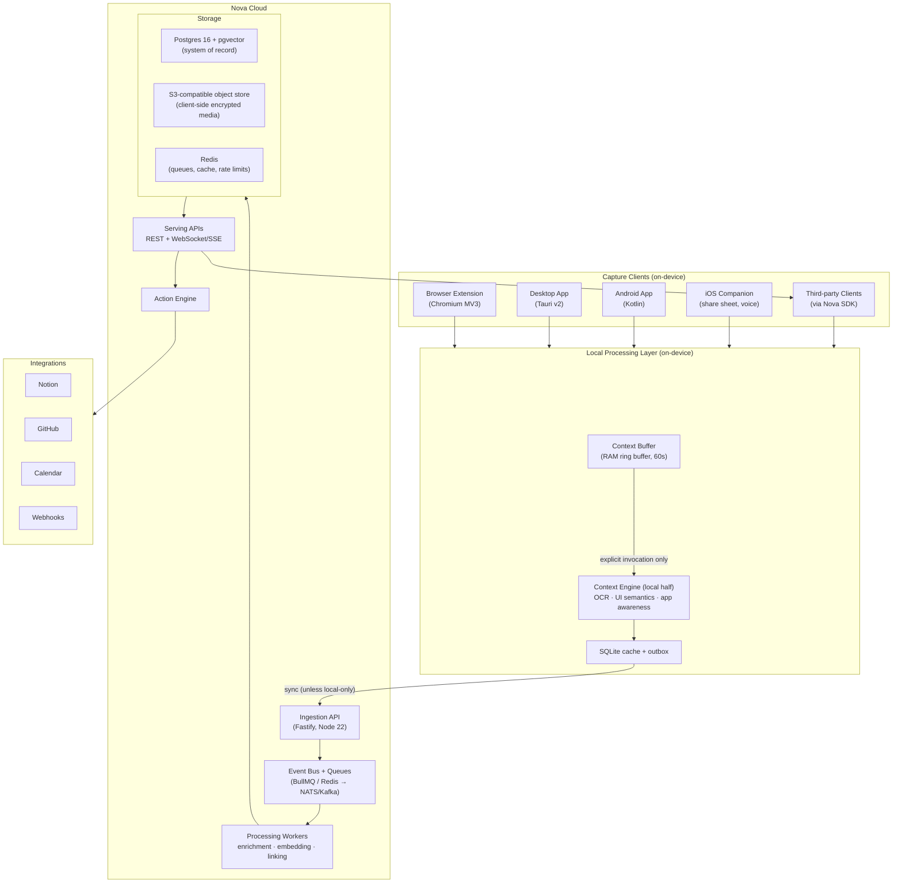

# Nova Context — System Architecture

**Why this document:** This is the master technical reference for Nova Context. It defines how the system is decomposed, what runs where (device vs. cloud), how data moves, and the tradeoffs behind every major decision. Every other engineering doc hangs off this one. If a detailed doc ([CONTEXT_ENGINE.md](./CONTEXT_ENGINE.md), [CONTEXT_BUFFER.md](./CONTEXT_BUFFER.md), etc.) appears to disagree with this document, this document wins and the other doc has a bug.

Nova Context is **Human Context Infrastructure**: a platform that captures, understands, preserves, connects, and transforms human digital context into intelligent action. It is not a chatbot. It is the substrate that assistants — Dona, Claude, ChatGPT, Gemini, Copilot, enterprise agents — plug into as clients via the Nova Developer Platform.

---

## 1. Architecture Overview



In prose: **capture clients** run the perception front line on the device. When the user invokes Nova, the local half of the **Context Engine** turns raw signals (frames, DOM, audio, app metadata) into a structured **Context Moment**. Moments land in a **SQLite outbox** and sync to the **ingestion API** (unless the project is pinned local-only). Ingestion validates, deduplicates, and drops events onto the **event bus**; **processing workers** enrich moments asynchronously (OCR cleanup, entity extraction, embedding, project linking) and write to **storage**. **Serving APIs** expose retrieval to Nova's own apps and to third-party clients. The **Action Engine** turns context plus intent into risk-tiered actions against integrations.

Two flows dominate:

1. **Instant Capture Mode** — invocation → capture visible context + spoken instruction → Context Moment → project link → action.
2. **Live Context Mode** — bounded, indicated live session → rolling Context Buffer → real-time Q&A grounded in the buffer → user-confirmed promotion of slices into Context Moments.

### 1.1 Walkthrough: Instant Capture

```mermaid
sequenceDiagram
    participant U as User
    participant C as Capture client
    participant L as Local processing
    participant API as Ingestion API
    participant Q as Queue
    participant W as Workers
    participant AE as Action Engine
    U->>C: invoke (shortcut/button) + speak instruction
    C->>L: frame + DOM/AX tree + app metadata + audio
    L->>L: OCR, UI normalization, extractor, moment assembly
    L->>L: persist to SQLite + outbox (capture confirmed < 500ms)
    L->>API: sync moment (skipped if project is local-only)
    API->>Q: context.moment.created
    Q->>W: enrich → embed → link
    W->>API: enrichment written; suggestions ready
    API-->>C: suggested project link (user confirms)
    C->>AE: create action (task / Notion page)
    AE-->>U: Tier 0 executed, or Tier 1 preview shown
```

The user-facing contract: capture is confirmed locally in under half a second; everything network-bound is asynchronous backfill. Stage-level latency budgets live in [CONTEXT_ENGINE.md](./CONTEXT_ENGINE.md) §1.

### 1.2 Walkthrough: Live Context

A live session is explicitly started (visible indicator, hard time cap), runs the Context Buffer locally, and streams *nothing* to the cloud by default. When the user asks a question, the client sends the *question plus a minimal grounded slice* (current keyframe, relevant transcript span) — not the buffer — to the Intelligence Engine for an answer. "Save this" promotes a user-confirmed slice into a normal Context Moment, which then follows the Instant Capture path from ingestion onward. Session lifecycle events (`context.session.started/frame/ended`) carry metadata and promoted content only, never raw buffer contents.

---

## 2. The Five Engines

| Engine | Responsibility (one line) | Detailed doc |
|---|---|---|
| Context Engine | Perception: turn raw screen/audio/DOM signals into structured, ranked, retrievable context | [CONTEXT_ENGINE.md](./CONTEXT_ENGINE.md) |
| Context Buffer | The opt-in, local, ephemeral 60s ring buffer that solves "you had to be there" | [CONTEXT_BUFFER.md](./CONTEXT_BUFFER.md) |
| Memory Engine | Layered memory + knowledge graph + versioning + forgetting | [MEMORY_ENGINE.md](./MEMORY_ENGINE.md) |
| Intelligence Engine | Model-agnostic orchestration and routing across LLM/vision/ASR providers | [INTELLIGENCE_ENGINE.md](./INTELLIGENCE_ENGINE.md) |
| Action Engine | Context + intent → risk-tiered, auditable actions in external systems | [ACTION_ENGINE.md](./ACTION_ENGINE.md) |

**Context Engine.** Perception. Screen understanding (layout segmentation, region classification), OCR (on-device first), UI semantics from DOM/accessibility trees, app awareness with per-surface extractors, video frame sampling and transcript alignment, audio ASR, plus the non-perceptual back half: tiered compression, relevance ranking, hybrid retrieval, and expiration. It produces and serves Context Moments; everything downstream consumes them.

**Context Buffer.** A short rolling buffer (default 60s, max 5 min) that exists only while the user has explicitly enabled it, lives in RAM or encrypted temp storage, is never uploaded wholesale, and is continuously overwritten. On invocation, buffer contents become *candidate* context; only user-confirmed slices are promoted into a Context Moment. It is the most privacy-sensitive component in the system and gets its own document for that reason.

**Memory Engine.** Layered memory: working (current invocation), session, project, relationship (people), semantic, visual, and long-term. Backed by a knowledge graph stored as relational tables in Postgres plus pgvector embeddings. Handles versioning (memories change; history is kept), decay and forgetting (unreferenced low-salience memories age out), and user control (view, edit, delete, export — deletion is real deletion, propagated to embeddings and graph edges).

**Intelligence Engine.** Model-agnostic orchestration in `packages/model-router`. Routes each task by type, cost, latency, and privacy tier across Anthropic Claude (default primary for vision + reasoning), OpenAI GPT (fallback), Google Gemini, and local models via Ollama/on-device. Fallback chains are declarative per task class; high-stakes outputs can optionally run multi-model consensus (post-MVP). Continuous benchmarking keeps routing tables honest. Privacy tier is a hard constraint: local-only projects never route to cloud providers.

**Action Engine.** Transforms context + intent into tasks, projects, research notes, documents, calendar events, GitHub issues, Notion pages, webhooks, and browser workflows. Risk-tiered: **Tier 0** auto-execute (internal, reversible — e.g., create a task in Nova's own list), **Tier 1** preview-then-confirm (external writes — e.g., Notion page), **Tier 2** explicit approval + audit trail (anything sending data to other people, purchases, messages). Human approval is a first-class primitive with its own state machine and API surface, not a dialog box bolted on.

---

## 3. Nova Developer Platform, SDK, and API Layer

Assistants are *clients* of Nova. The platform surface is:

- **REST + JSON** for CRUD on moments, memory, projects, actions.
- **WebSocket/SSE** for live sessions and event streams (a third-party assistant can subscribe to `context.moment.created` for its user, with consent).
- **Webhooks** for server-to-server delivery.
- **SDKs**: TypeScript first (shared Zod schemas from `packages/schema` generate the client types), then Kotlin, Swift, Python.
- **Plugins + marketplace** (post-GA): capture extractors and action integrations authored by third parties, sandboxed and permission-scoped.

The serving surface at a glance (full reference: [API_AND_SDK_SPEC.md](./API_AND_SDK_SPEC.md)):

| Surface | Examples | Scope required |
|---|---|---|
| Moments | `POST /v1/moments`, `GET /v1/moments/:id`, `POST /v1/context/search` | `context:capture` / `context:read` |
| Live sessions | `POST /v1/sessions`, `WS /v1/sessions/:id/stream` | `context:capture` |
| Memory | `GET /v1/memory/query`, `PATCH /v1/memory/:id` | `memory:read` / `memory:write` |
| Actions | `POST /v1/actions/propose`, `POST /v1/actions/:id/execute` | `action:propose` / `action:execute` |
| Events | `POST /v1/webhooks`, `GET /v1/events/stream` (SSE) | per-event-type scopes |
| Audit | `GET /v1/audit` (user's own trail) | any authenticated user |

Two platform rules that hold everywhere: **the Context Buffer has no API** — no scope, no endpoint, no SDK method reads the ring; third parties receive context exclusively as promoted Context Moments ([CONTEXT_BUFFER.md](./CONTEXT_BUFFER.md) §5). And **rate limits are per key and per user**, enforced in Redis at the gateway, with metered-API billing counted from the same counters so billing and throttling can never disagree.

---

## 4. The Local-First Split

Local-first is an architecture decision, not a slogan. The rule: **perception and buffering are on-device; cloud is for heavy reasoning, embedding, and sync — always with data minimization.**

| Runs on device | Runs in cloud |
|---|---|
| Context Buffer (entirely; never synced) | Enrichment workers (entity extraction, linking) |
| Frame capture, downscaling, sampling | Embedding generation (unless local embeddings suffice) |
| OCR (platform OCR APIs first) | LLM reasoning and vision calls (per privacy tier) |
| DOM / accessibility-tree extraction | Cross-device memory sync |
| App/window/URL awareness | Retrieval index at scale (pgvector) |
| Redaction of secure fields, allow/denylists | Action execution against integrations |
| SQLite cache + outbox, offline queue | Audit log aggregation |
| Local ASR (whisper.cpp via companion, post-MVP) | Cloud ASR (MVP, with disclosure) |

**Privacy tiers:**

- **Local-only projects**: pinned by the user; their moments, media, and embeddings never leave the device. Retrieval for these projects runs against the local SQLite index. The Intelligence Engine may only route local-only content to on-device models. This is enforced in the sync layer, not by convention: local-only rows never enter the outbox.
- **Standard**: structured moments and embeddings sync to cloud; media is client-side encrypted before upload (server holds ciphertext, keys stay with the user's devices).
- **Ephemeral**: Live Context Mode buffer content that was never promoted — it is never persisted anywhere, device included.

The cost of local-first: on-device perception quality varies by platform (see platform notes in [CONTEXT_ENGINE.md](./CONTEXT_ENGINE.md)), local-only projects lose cross-device sync and cloud-model quality, and we maintain two retrieval paths. We accept all three; the trust properties are the product.

### 4.1 Sync Protocol

Device → cloud sync is deliberately boring:

- **Outbox drain**: the SQLite outbox is append-only; each row carries the moment payload, its `idempotency_key`, and a monotonic per-device sequence number. The client POSTs batches (≤50 rows) to `/v1/sync/moments`; the server acks by sequence number; acked rows are pruned. Retries with exponential backoff + jitter; duplicates are collapsed server-side by the idempotency key's unique constraint.
- **Media upload**: separate path — client encrypts, requests a presigned PUT, uploads ciphertext, then references the object key in the moment row. A moment can sync before its media finishes; the media row stays `pending` until the hash-verified upload lands.
- **Downstream sync** (cloud → device): cursor-based pull of enrichment results and cross-device moments, over the same authenticated channel; SSE nudges the client that a pull is worthwhile rather than pushing content.
- **Conflict policy**: moments are immutable once created (enrichment appends, never rewrites capture-time fields), so sync has no merge problem for its core entity. Mutable entities (project names, settings) use last-writer-wins with server timestamps — acceptable because they are low-stakes and low-frequency; we did not build CRDTs for a settings page.

---

## 5. Storage Architecture

**Postgres 16 + pgvector — system of record.** All structured data: users, projects, Context Moments (structured fields), memory layers, knowledge-graph entities and edges (relational tables — see §10), actions, audit log, API keys, webhook subscriptions. Embeddings live in pgvector columns with HNSW indexes. Drizzle ORM; schemas shared with the API via `packages/schema` (Zod).

**S3-compatible object storage — media.** Frames, audio clips, and any binary payloads are client-side encrypted (per-user key hierarchy, XChaCha20-Poly1305) before upload. The server stores ciphertext and a content hash; it cannot render user screens. Media rows in Postgres hold the object key, hash, and TTL. Consequence we accept: no server-side thumbnailing or server-side vision on stored media — vision calls happen client-side-initiated with the plaintext, or on freshly captured frames before encryption.

**SQLite on-device — cache and outbox.** Every client embeds SQLite: local moment cache for offline retrieval, the sync outbox (append-only, idempotency keys assigned at write time), local-only project storage, and settings. Outbox drains FIFO with exponential backoff when connectivity returns.

**Redis — queues, cache, coordination.** BullMQ queues, hot-path caches (session state, rate-limit counters), and pub/sub fan-out for SSE. Redis is never a system of record; losing it loses in-flight jobs only, and at-least-once delivery from the outbox re-fills them.

### 5.1 Core Data Model (overview)

The load-bearing tables, at a glance (full DDL lives in `packages/db`):

| Table | Purpose | Notable columns |
|---|---|---|
| `users`, `devices` | identity; per-device sync state | device public keys (media encryption) |
| `projects` | organizing unit for context | `privacy_tier` (`standard` \| `local_only` — local_only rows exist only on-device) |
| `moments` | Context Moments, structured fields | `intent_utterance`, `source_app`, `canonical_url`, `idempotency_key` (unique) |
| `moment_media` | frame/audio object refs | object key, content hash, `expires_at` (TTL) |
| `moment_text` | OCR lines, page text, transcript segments | `tsvector` column (full-text) |
| `embeddings` | pgvector rows, multiple granularities | HNSW index; FK cascade from `moments` |
| `entities`, `edges` | knowledge graph, relational form | typed edges: `mentions`, `about`, `same_as`, `works_with` |
| `memories` | Memory Engine layers | `layer`, `version`, `decayed_at` |
| `actions` | Action Engine state machine | `tier` (0/1/2), `status`, `approval_id` |
| `audit_log` | user-facing audit trail | append-only; actor, scope, entity ref — never content |
| `api_keys`, `grants` | platform auth | hashed keys, scope arrays |

Design invariant worth naming: **every content-bearing row is reachable from exactly one user and one privacy tier**, so deletion and local-only enforcement are single-predicate queries, not archaeology.

### 5.2 Scale Envelope (MVP → growth)

Numbers we design against, so "will it hold" is a calculation, not a debate: an active user captures ~30 moments/day (~150 KB structured + ~2 MB media each). At 10k active users that is ~300k moments/day — trivial for Postgres writes (<10 wps sustained), ~6 GB/day of encrypted media, and ~1M embeddings/month. pgvector with HNSW comfortably serves ~10M vectors per index at our latency targets; at 10k users we hit that in roughly a year, which is why the pgvector exit criteria in §10 are defined *now*, with measurement, rather than mid-incident later.

---

## 6. Event System

The backend is event-driven. Canonical event taxonomy (dot-namespaced, versioned payloads validated by Zod schemas in `packages/schema`):

```
context.moment.created        # a Context Moment was ingested
context.session.started       # Live Context session opened (bounded, indicated)
context.session.frame         # sampled frame/segment within a live session
context.session.ended         # session closed (user stop, timeout, or hard cap)
memory.updated                # memory layer changed (new link, version, decay)
action.proposed               # Action Engine proposes an action (any tier)
action.approved               # human approval granted (Tier 1/2)
action.executed               # action ran against an integration
action.failed                 # execution failed; includes retry state
```

Event envelope (every event, uniform):

```json
{
  "id": "evt_01J9XQ4K7M...",
  "type": "context.moment.created",
  "schemaVersion": 3,
  "occurredAt": "2026-07-09T14:32:11.402Z",
  "userId": "usr_01H...",
  "idempotencyKey": "01J9XQ4K7M2P...",
  "traceparent": "00-4bf92f3577b34da6a3ce929d0e0e4736-00f067aa0ba902b7-01",
  "payload": { "momentId": "cm_01J...", "projectHint": "prj_01H...", "privacyTier": "standard" }
}
```

Payloads reference entities by ID; they do not embed content. A webhook consumer that wants the moment's text must fetch it with a scoped token — which means every content access hits the permission check and the audit log, instead of content leaking through queue plumbing.

**Delivery guarantees: at-least-once, with idempotency keys.** Every event carries an `idempotency_key` (ULID, minted by the producing client or service). Workers and webhook consumers must treat processing as idempotent: workers check a processed-keys table (Postgres, unique constraint) before side effects; webhook consumers are documented to do the same and receive the key in the `Nova-Idempotency-Key` header. We chose at-least-once over exactly-once because exactly-once across process boundaries is a myth you pay for in latency and complexity; idempotency keys make duplicates harmless.

Ordering is guaranteed only per-session (session events are processed by a single worker keyed on `session_id`), not globally. Consumers must not assume cross-entity ordering.

---

## 7. Queues: BullMQ Now, NATS/Kafka Later

**MVP: BullMQ on Redis.** One dependency we already run, delayed jobs and retries with backoff out of the box, first-class TypeScript. Queues: `enrich` (OCR cleanup, entity extraction), `embed`, `link` (project suggestion), `action`, `webhook-deliver`.

**When we switch, and to what.** BullMQ's ceiling: it is a job queue, not a log. No replay, no consumer groups over a shared stream, fan-out means enqueueing N copies. We move to **NATS JetStream** (preferred: operationally light, at-least-once streams, good fit for our event taxonomy) or Kafka (if a design partner demands it or we exceed ~10k events/sec sustained) when any of these becomes true:

1. More than ~3 independent consumers need the same event stream (platform webhooks + analytics + memory + partner streams).
2. We need replay for reprocessing (e.g., re-embedding the corpus with a new model — today we'd re-drive from Postgres, which works but is a batch job, not a stream).
3. Multi-region (Redis-per-region queues don't give a coherent global stream).

The migration is bounded by design: producers emit through a thin `packages/events` interface; only its transport binding changes.

---

## 8. Permissions Model (Summary)

- **User auth: OAuth 2.1 + PKCE.** All first-party and third-party user-delegated access. No implicit flow, no password grant.
- **Service auth: scoped API keys** for server-to-server platform clients, prefixed (`nova_sk_...`), hashed at rest, rotatable, per-key rate limits.
- **Scopes** (requested at consent, enforced at the API gateway and again at the service layer):
  - `context:read` — read Context Moments
  - `context:capture` — submit new moments (capture on the user's behalf)
  - `memory:read` — query memory layers
  - `memory:write` — create/update memories
  - `action:propose` — propose actions (lands as Tier-appropriate proposal)
  - `action:execute` — execute approved actions
- Third parties can never bypass the Action Engine's risk tiers: `action:execute` executes *approved* actions; it does not skip approval.
- Every grant, key, and scope use is visible in the user-facing audit log (§9).

Details: [SECURITY_AND_PRIVACY.md](./SECURITY_AND_PRIVACY.md) and [API_AND_SDK_SPEC.md](./API_AND_SDK_SPEC.md).

---

## 9. Observability

- **OpenTelemetry** traces end-to-end: client capture span → ingestion → queue → worker → storage, linked by trace context propagated in event payloads. Sampled head-based at 10% for normal traffic, 100% for errors and Tier 2 actions.
- **Structured logs (pino), with a hard rule: no context payloads in logs.** No OCR text, no transcripts, no URLs beyond registrable domain, no frame data. Log the moment ID and sizes, never the content. Enforced by a redaction serializer in the shared logger package and a CI grep for banned fields; treat violations as incidents, not bugs.
- **User-facing audit log**, surfaced in-product: every capture, every third-party read, every action proposal/approval/execution, every key use. This is a product feature, not an ops table — trust requires the user seeing exactly what touched their context and when.
- Metrics: queue depth/age, enrichment latency p50/p95, embedding throughput, provider error rates per model (feeds Intelligence Engine routing), sync outbox depth per client.

Starting SLOs (alerts are wired to these, not to raw metrics):

| SLO | Target |
|---|---|
| Capture confirmed locally | p95 < 500 ms (client-measured) |
| Moment visible in web app after sync | p95 < 10 s |
| Enrichment complete (summary, entities, embedding) | p95 < 60 s |
| Retrieval (`/v1/context/search`) | p95 < 300 ms |
| Live-session answer (question → grounded response) | p95 < 4 s |
| API availability | 99.9% monthly |

---

## 10. Explicit Tradeoffs

### 10.0 Code and Deployable Layout

The monorepo (pnpm + Turborepo, TypeScript throughout) makes the module boundaries concrete:

```
apps/
  extension/        # Chromium MV3 (WXT + React) — MVP capture client
  web/              # Next.js — timeline, projects, action review
  api/              # Fastify service: ingestion + serving + Action Engine
  worker/           # BullMQ consumers: enrich, embed, link, action, webhook-deliver
  companion/        # local service (ASR bridge, later local models); desktop (Tauri v2) later
packages/
  schema/           # Zod schemas: Context Moment, events, API DTOs — single source of truth
  events/           # thin event-emit interface (transport-swappable: BullMQ → NATS)
  model-router/     # Intelligence Engine core: routing tables, fallback chains
  retrieval/        # hybrid search behind one interface (pgvector | SQLite FTS5)
  db/               # Drizzle schema + migrations
  sdk/              # public TypeScript SDK (generated from packages/schema)
```

Two deployables (`api`, `worker`) share one schema and one database. Engines live as packages with explicit interfaces; the extraction path to services, if ever needed, follows package boundaries.

**Monolith-first Fastify service vs. microservices.** We ship one Fastify (Node 22) service containing ingestion, serving, and the Action Engine, plus a separate worker process sharing the same codebase. We choose the modular monolith because at MVP scale the enemy is iteration speed and operational surface, not service coupling; two deployables (api, worker) on one schema is the whole footprint. The cost: we must enforce module boundaries in-process (each engine is a package with an explicit interface; no reaching into another engine's tables) or the eventual extraction becomes a rewrite. Extraction candidates, in order, when scale demands: workers by queue, then the Action Engine (it holds integration credentials and benefits from blast-radius isolation).

**Postgres + pgvector vs. dedicated vector DB.** pgvector keeps embeddings transactionally consistent with the rows they describe — delete a moment, its vector dies in the same transaction, which matters enormously for real deletion guarantees. One database to operate, back up, and reason about. The cost: HNSW index build/write throughput and recall at very large scale trail Qdrant/Weaviate/Vespa. We accept that until a measured threshold (~50M vectors per shard or p95 retrieval > 200ms with tuned HNSW), and we keep the retrieval interface narrow (`packages/retrieval`) so a dedicated engine can slot in behind it. Do not migrate on vibes; migrate on benchmarks.

**Relational knowledge graph vs. graph DB.** Entities and edges are two Postgres tables with typed columns and indexes, queried with recursive CTEs where needed. Our graph queries are shallow (1–3 hops: moment → entities → related projects/people), which SQL handles fine, and we get joins against the rest of the schema for free. A graph DB (Neo4j) earns its operational cost only for deep variable-length traversals and graph algorithms we don't run yet. Cost of our choice: multi-hop query ergonomics are worse, and if memory-graph features grow genuinely graphy (community detection, path ranking), we revisit — with the graph living behind the Memory Engine's interface, not leaked into callers.

**Tauri v2 vs. Electron (desktop, post-MVP).** Tauri: smaller footprint, Rust core for the capture-adjacent code paths. Cost: less mature ecosystem than Electron, fewer batteries included. Accepted; the desktop app's perf-sensitive capture loop benefits more from Rust than we lose in ecosystem.

---

## 11. Deployment Model

1. **Dev: Docker Compose** — Postgres 16 + pgvector, Redis, MinIO (S3-compatible), api, worker, web (Next.js). One `docker compose up`; seeds included.
2. **MVP: Fly.io or Railway** — managed Postgres, managed Redis, app + worker as separate processes, object storage via Tigris/R2. Single region. Chosen for deploy velocity, not architecture purity.
3. **Growth: multi-region** — read replicas, region-pinned user data (EU residency), NATS for cross-region events, Terraform for everything.
4. **Enterprise: self-host / VPC** — the entire backend ships as a container set (the Docker Compose topology is the self-host topology, deliberately); customer brings Postgres/Redis/S3. No phone-home except license check. SSO/SCIM at this tier.

CI/CD: monorepo (pnpm + Turborepo), affected-package builds, migrations run gated ahead of deploy, one-command rollback (previous image + backward-compatible migrations only — every migration must be safe to run against the previous app version).

---

## 12. Failure Modes and Degradation

The system degrades in layers; capture must survive everything above it.

| Failure | Behavior |
|---|---|
| Device offline / API unreachable | Capture continues fully; moments queue in the SQLite outbox; retrieval serves from local cache. Sync drains with backoff on reconnect. The user should barely notice. |
| Primary model provider down | Intelligence Engine walks the fallback chain (Claude → GPT → degraded local/no-LLM mode). In no-LLM mode, capture and OCR still work; enrichment (summaries, linking suggestions) is queued and backfilled when a provider returns. |
| ASR provider down | Push-to-talk audio is stored (encrypted) and transcribed when service returns; the moment is created immediately with `transcript_pending`. |
| Redis down | Ingestion API accepts writes directly to Postgres with a `pending_enqueue` flag; a sweeper re-enqueues when Redis returns. Live sessions degrade: SSE fan-out pauses, buffer stays local (it always was). |
| Postgres down | The one true outage. API returns 503; clients keep capturing into the outbox. Nothing is lost; everything is late. |
| Worker crash mid-job | At-least-once + idempotency keys: the job re-runs; duplicate side effects are suppressed by the processed-keys table. |
| Integration (Notion/GitHub) down | Action executes go to `action.failed` with retry + backoff; user sees state in action review UI; Tier 1/2 approvals never expire silently — they re-prompt. |
| Buffer memory pressure | Ring buffer drops oldest entries; hard caps enforced (see [CONTEXT_BUFFER.md](./CONTEXT_BUFFER.md)). Capture quality degrades before the host app does. |

Design rule underneath all of it: **the capture path has no synchronous cloud dependency.** Anything that requires the network is asynchronous, queued, and resumable.

---

## 13. Document Map

- [CONTEXT_ENGINE.md](./CONTEXT_ENGINE.md) — perception pipeline in detail
- [CONTEXT_BUFFER.md](./CONTEXT_BUFFER.md) — the rolling buffer: lifecycle, encryption, consent, threat model
- [MEMORY_ENGINE.md](./MEMORY_ENGINE.md) — memory layers, knowledge graph, forgetting
- [INTELLIGENCE_ENGINE.md](./INTELLIGENCE_ENGINE.md) — model routing, fallbacks, benchmarking
- [ACTION_ENGINE.md](./ACTION_ENGINE.md) — risk tiers, approval primitive, integrations
- [API_AND_SDK_SPEC.md](./API_AND_SDK_SPEC.md) — Developer Platform surface
- [SECURITY_AND_PRIVACY.md](./SECURITY_AND_PRIVACY.md) — full threat model and data handling
- [MVP_SCOPE.md](./MVP_SCOPE.md) / [BUILD_PLAN.md](./BUILD_PLAN.md) — what we're building first and in what order
